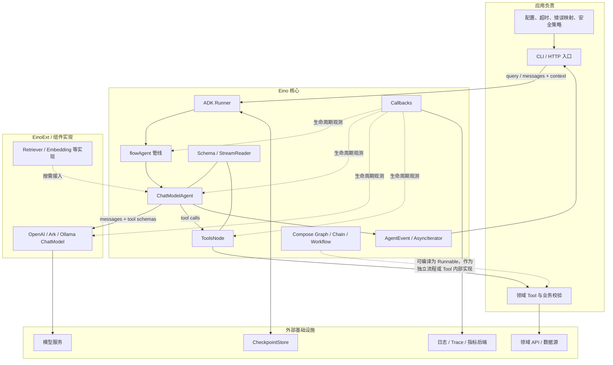
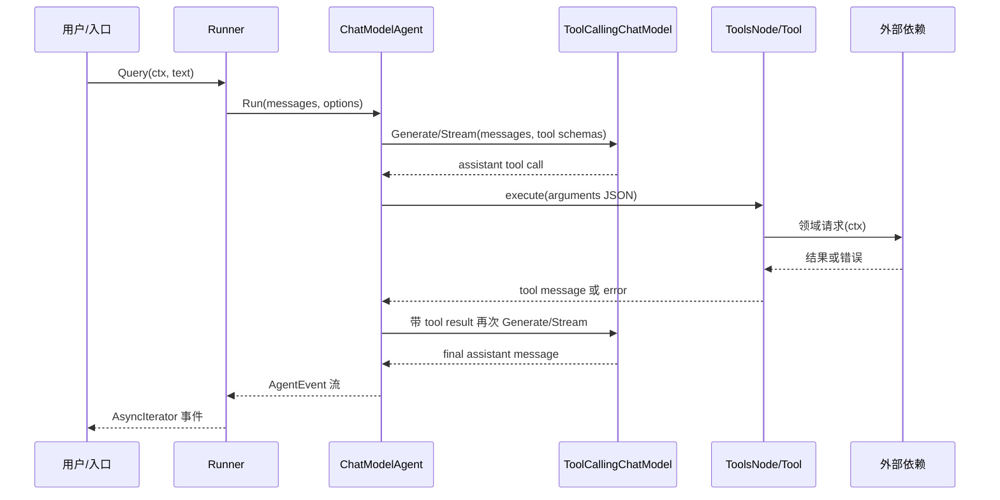

# Eino v0.9.12 架构图与责任边界

## 版本与结论

- 版本范围：Eino `v0.9.12`，commit `13e1a25c7238293a1e558391a65525a464acb324`。
- 主类别：AI 组件与 Agent 编排框架。
- 本轮推荐主路径：`ChatModelAgent + Tool + Runner`。
- Compose 定位：需要精确控制时使用的确定性 Graph/Chain/Workflow；不是本轮第一版纵向项目的入口。
- 结论状态：定位和组件关系已由 tag README、源码与版本匹配示例交叉核对，并于 2026-07-15 通过决策门 1；官方 ChatModelAgent 示例已实际完成 Tool、Interrupt、Resume 和最终回答链路。

## 系统拓扑



## 一次输入的主控制流



正常路径中，ChatModel 决定是否调用 Tool；ToolsNode 根据 Tool schema 和调用参数执行 Tool；Tool 结果作为消息回到模型，直到产生最终回答。若任一步返回错误，应用必须从 `AgentEvent.Err`、StreamReader 读取错误和 Callback 观测联合判断，不能只看最终文本。

## 关键组件关系

| 组件 | 输入/输出 | 生命周期与扩展点 | 本轮关注 |
|---|---|---|---|
| `Runner` | Query/消息 -> `AsyncIterator[AgentEvent]` | `Run`、`Query`、`Resume`，可选 CheckpointStore | 主入口、context、事件与错误 |
| `ChatModelAgent` | 消息 -> 模型/工具循环 -> AgentEvent | Instruction、Model、ToolsConfig、Handlers、MaxIterations | ReAct 分叉与错误传播 |
| `ToolCallingChatModel` | 消息 + ToolInfo -> 完整或流式消息 | `Generate`、`Stream`、不可变 `WithTools` | 测试替身、工具调用、流式迁移 |
| `BaseTool` / `InvokableTool` | ToolInfo；JSON 参数 -> 字符串结果 | `Info`、`InvokableRun`，可用 `utils.InferTool` | 参数 schema、业务错误、依赖边界 |
| `ToolsNode` | 模型 ToolCall -> Tool 执行结果 | 工具列表、返回直达、内部事件 | 工具选择与执行故障定位 |
| `Callbacks` | 组件 RunInfo + 输入/输出/错误 | 全局或单次调用；五个 timing | 耗时、组件名、错误；流副本关闭 |
| `Schema/StreamReader` | Message、ToolCall、Document、流块 | 流只读一次，多消费者需复制并关闭 | 事件消费、资源释放、流内错误 |
| `Compose Runnable` | I/O 或流式 I/O | Invoke、Stream、Collect、Transform | 建立边界理解；本轮不与 Agent 同时扩展 |

## 核心运行分叉

```text
ChatModelAgent.getRunFunc
├── 未配置 Tool -> buildNoToolsRunFunc
└── 配置 Tool   -> buildReActRunFunc
    ├── ChatModel 返回最终消息 -> AgentEvent -> 结束
    └── ChatModel 返回 ToolCall -> ToolsNode -> Tool result -> 下一轮 ChatModel
```

这条分叉由 `v0.9.12/adk/chatmodel.go` 直接验证。删除 `buildReActRunFunc` 对应机制后，应用只剩模型调用，必须自行实现 Tool 循环，因而不能作为本轮完整 Eino 主路径。

## 数据流与错误流

| 流 | 载荷 | 正常传播 | 故障入口 | 观测要求 |
|---|---|---|---|---|
| 控制流 | `context.Context`、AgentRunOption | 入口 -> Runner -> Agent -> Model/Tool | deadline、cancel、interrupt | 保留 `errors.Is` 可判定性 |
| 消息流 | `schema.Message` / stream chunks | 用户 -> 模型 -> Tool message -> 模型 -> 用户 | 无效 ToolCall、流读取错误 | 非流看 event/callback；流错误必须读 StreamReader |
| 工具流 | ToolInfo + JSON arguments -> result | Model -> ToolsNode -> Tool -> Model | schema、业务校验、外部依赖 | 记录工具名与错误分类，不记录敏感参数 |
| 观测流 | Callback RunInfo/input/output/error | 组件生命周期 -> handler -> 后端 | handler 误用流副本、并发修改 | stream copy 必须关闭；handler 不修改共享输入输出 |

## 责任边界

### Eino 核心负责

- 公开组件契约与通用 option。
- Message、ToolCall、Document 与 StreamReader 等 schema。
- Agent 生命周期、ReAct 工具循环、事件、取消、中断与 checkpoint 契约。
- Graph/Chain/Workflow 的编译、执行和数据流范式适配。
- 固定生命周期时点的 Callback 传播。

### 应用必须负责

- 选择模型和 EinoExt 实现，校验环境变量与配置。
- 定义 Agent 指令、Tool schema、领域校验和错误类型。
- 设置请求级 deadline、重试/降级策略；不能假定框架自动替业务决定。
- 完整消费 AgentEvent 和 StreamReader，关闭流并处理每个错误。
- 控制日志、Trace 与指标中的敏感信息，提供 HTTP/CLI 层错误映射。
- 为外部模型和领域服务提供离线测试替身。

### Eino 不替代

- 模型厂商 SLA、配额、内容安全和数据合规。
- 业务服务、数据库、缓存及其一致性设计。
- 生产部署、容量规划、发布回滚、灾备与密钥管理。
- 面向用户的 HTTP/SSE 协议语义；官方 SSE 示例也是应用层适配。

## 主路径与替代路径

| 路径 | 推荐级别 | 适合场景 | 本轮处理 |
|---|---|---|---|
| `ChatModelAgent + Tool + Runner` | 推荐主路径 | 模型自主选择工具并形成 Agent 循环 | 阶段 2 至阶段 5 的主线 |
| Compose Graph/Chain/Workflow | 推荐次路径 | 步骤、分支和状态必须精确可控 | 先理解边界；后续单独实践 |
| DeepAgent / 多 Agent | 暂缓 | 复杂任务分解与协作 | 超出 L2 最小范围 |
| 直接调用 ChatModel | 仅作组件冒烟测试 | 无 Tool、无编排的单次生成 | 不能作为 Eino L2 纵向项目 |

## 纵向项目为何选择天气 Agent

天气查询的业务足够小，但能稳定触发 Eino 的关键机制：模型生成 ToolCall、ToolsNode 调用领域 Tool、Tool 使用 context 访问外部边界、结果回到模型、Runner 输出事件、Callbacks 标记组件生命周期。它还能用同一条链路注入三类 L2 故障：

- 超时：WeatherProvider 阻塞直到 context deadline。
- 业务错误：城市参数不合法或不支持。
- 依赖不可用：WeatherProvider 返回受控连接失败。

默认使用可编程 ChatModel 和受控 WeatherProvider，避免真实模型的非确定性掩盖框架行为。在线模型是单独的显式实验，不进入默认 `go test ./...`。单变量迁移只把 Runner 从非流式切换为流式，验证 MessageStream 消费、关闭和流内错误观测，而不同时更换模型、Tool 或业务逻辑。

## 当前未决项

- 真实运行链路、故障矩阵和源码导航必须由阶段 2 至阶段 6 的实际结果生成，本文件不提前声称已验证。
