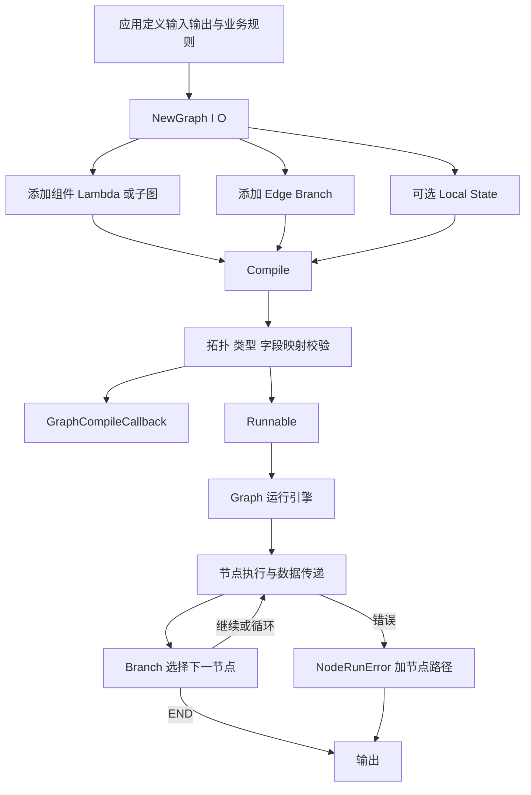
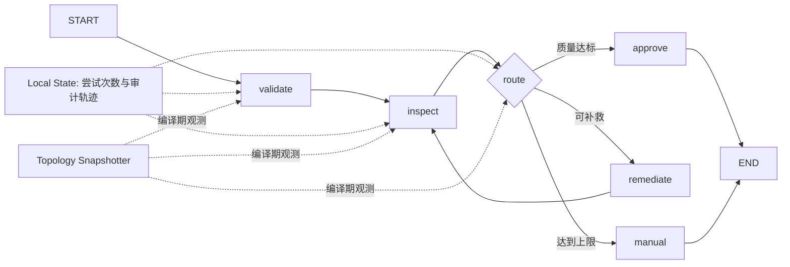

# Eino Compose v0.9.12 架构全景

## 版本限定

本文只描述当前项目锁定的 Eino `v0.9.12`。证据来自同版本模块源码、tag README 和精确依赖该版本的官方示例 commit `171220631fb7068ead50b7cd964b8c471647117d`。

## 一句话架构

`官方说明` Compose 把类型化组件和 Lambda 组织为可编译拓扑，通过统一 `Runnable` 执行单值或流式数据流；应用负责业务节点和分支规则，Compose 负责拓扑校验、调度、运行级状态、回调与节点路径错误。

## 构建与运行链路



## 三种构建器

### Graph

`已验证` Graph 是最通用的显式拓扑入口。应用直接声明节点、边和 Branch，可以表达循环，并应通过 `WithMaxRunSteps` 为循环设置上限。本轮选择 Graph，因为纵向项目需要“检查、补救、重新检查”的确定性循环。

### Chain

`已验证` Chain 在内部创建 Graph，提供 `Append...` builder。它适合以顺序为主、偶尔插入并行或分支的管线。若主路径需要频繁回边和显式节点键，Chain 的简洁性收益会下降。

### Workflow

`已验证` Workflow 用依赖和字段映射替代直接 `AddEdge`，固定使用 `AllPredecessor`，源码明确不支持循环。它适合 DAG、fan-in 和结构化字段汇聚，不适合作为本轮有界补救循环的主入口。

## Graph 核心对象

| 对象 | 输入 | 输出 | 责任 |
|---|---|---|---|
| `Graph[I,O]` | 节点、边、分支、构建选项 | 待编译拓扑 | 保存应用声明的控制流和数据流 |
| 组件节点 | Eino 标准组件输入 | 组件输出 | 调用 ChatModel、Tool、Retriever 等能力 |
| `Lambda` | 应用类型 | 应用类型 | 承载校验、转换和领域逻辑 |
| `GraphBranch` | 上游节点输出 | 目标节点键 | 在声明的候选节点中选择后继 |
| Local State | `WithGenLocalState` 生成值 | 节点和 Branch 可访问状态 | 在一次运行内共享状态并提供互斥访问 |
| `GraphCompileCallback` | `GraphInfo` | 无返回值 | 编译完成后的拓扑观测扩展 |
| `Runnable[I,O]` | 单值或流 | 单值或流 | 统一 Invoke、Stream、Collect、Transform |

## Local State 边界

`已验证` `WithGenLocalState` 的生成函数在运行上下文中提供状态，`ProcessState` 通过互斥锁访问当前或父 Graph 的匹配类型状态。它解决的是运行内跨节点共享和并发访问，不是数据库持久化，也不等同于 checkpoint。

```text
一次 Runnable 调用
-> 生成本次 Local State
-> 节点 Pre Handler / Lambda / Post Handler / Branch 受控访问
-> 调用结束后不承诺跨请求保留
```

非流式 State Pre/Post Handler 会把流读取并合并为单值。需要保持真实流式语义时，应使用 Stream State Handler，并单独验证资源关闭和错误传播。

## 扩展点选择

本轮 L3 选择自定义 `GraphCompileCallback`，原因是它是明确的公开扩展接口，并能从 `GraphInfo` 获取节点、边、分支、类型和嵌套 Graph 信息。

推荐扩展职责：

- 复制必要的不可变拓扑摘要，用于日志、测试或可视化。
- 对节点键和边排序，保证快照稳定可比较。
- 不保留 `GraphNodeInfo.Instance` 等业务对象引用。
- 通过 `WithGraphCompileCallbacks` 按次注入，避免全局可变状态污染测试和并发编译。

明确限制：`OnFinish` 没有错误返回值，因此该接口不能阻止编译。强制策略校验应放在应用构建器或编译前校验函数中，不能伪装成 Compile Callback 能力。

## 错误与可观测性

```text
领域或依赖错误
-> Lambda / 组件节点返回 error
-> Compose 包装 NodeRunError 并追加节点路径
-> Graph 返回 error
-> internalError.Unwrap 返回原始错误
-> 应用 errors.Is / errors.As 分类
```

运行时 Callback 用于节点生命周期观测；Graph Compile Callback 用于编译后拓扑观测。两者不能互相替代，也都不应吞掉业务错误。

## 责任边界

| 层级 | 负责 | 不负责 |
|---|---|---|
| Compose 构建层 | 节点、边、Branch、字段映射、状态配置、编译选项 | 判断领域规则是否正确 |
| Compose 运行层 | 调度、数据传递、循环步数、数据流适配、错误路径 | 外部依赖重试、业务补偿和持久化 |
| 应用层 | 节点输入输出、分支条件、退出条件、状态结构、超时与幂等 | 复制 Pregel 调度器和使用 `internal` 包 |
| 组件层 | 模型、工具、检索等实际能力 | 决定全局 Graph 拓扑 |
| 基础设施 | 网络服务、数据库、日志和 Trace 存储 | 保证 Graph 内业务状态正确 |

## 纵向项目映射



该候选保留 Graph 的显式分支、循环、本地状态、最大步数和扩展接口。Inspector 通过应用接口隔离，默认测试不访问网络；真实模型或内容审核服务的替换留到单变量迁移阶段。
