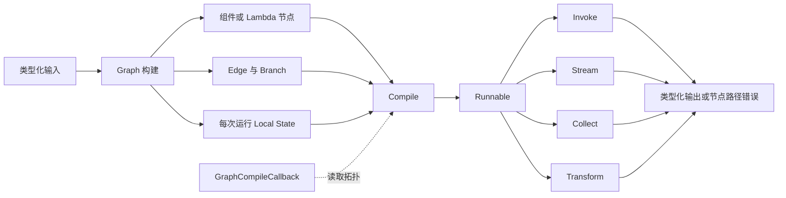

# Eino Compose L3 学习协议

## 当前状态

| 项目 | 值 |
|---|---|
| 学习工作区 | 仓库根目录 |
| 源码来源 | `module`：`github.com/cloudwego/eino@v0.9.12`；官方示例仓库作为辅助证据 |
| 框架版本 | Eino `v0.9.12`，commit `13e1a25c7238293a1e558391a65525a464acb324` |
| 目标等级 | L3：扩展定制 |
| 当前阶段 | 阶段 1：第一版 Compose 全景图已完成 |
| 当前决策门 | 决策门 1：等待确认版本与 Graph 主路径 |
| 最近更新 | 2026-07-19 |

## 输入解析

| 字段 | 解析结果 | 说明 |
|---|---|---|
| `workspace` | 当前仓库 | 沿用现有 Eino 学习工作区 |
| `source` | `module` | 从根 `go.mod` 解析当前项目实际使用的版本 |
| `module` | `github.com/cloudwego/eino@v0.9.12` | 不改用远程 `main` 或 `v0.10.0-alpha` |
| `target_level` | L3 | 承接已通过的 Eino L2，主题为 Compose 确定性编排 |
| `mode` | `execute` | 用户已授权开始学习，但仍遵守三个决策门 |
| `output` | `docs/learning/eino/compose/` | 与已完成的 Eino L2 产物分离 |

## 目标变更影响

- `建议` 保留 [Eino L2 协议](../learning-protocol.md) 的完成状态，不把新主题回写成 L2 未完成。
- `已验证` 根模块已锁定 Eino `v0.9.12`，本轮不升级 Go、Eino 或 EinoExt。
- `建议` 复用 L2 已掌握的 Callback、错误链和流所有权结论，但 Compose 的 Graph 构建、状态、分支和编译扩展必须单独验证。
- `建议` L3 首个扩展聚焦 `GraphCompileCallback` 拓扑观测，不同时引入 checkpoint、Agent Tool、多 Agent 或真实模型服务。

## 学习目标

- 目标能力：能为确定性业务控制流选择 Graph、Chain 或 Workflow，并解释选择依据。
- 目标能力：能构建包含类型化节点、显式分支、受控循环、每次运行本地状态和节点错误定位的 Graph。
- 目标能力：实现一个自定义 `GraphCompileCallback` 拓扑观测扩展，并验证其在嵌套 Graph 和并发编译场景下的兼容边界。
- 完成定义：官方完整示例实际运行；自定义纵向项目覆盖正常路径和三类故障；扩展实现、回归测试、源码链路和单变量迁移均有实际证据。
- 不在范围：Compose checkpoint/恢复、Graph 暴露为 Agent Tool、真实模型调用、RAG、多 Agent、生产部署和容量评估。

## 版本基线

| 对象 | 版本/位置 | 依据 | 状态 |
|---|---|---|---|
| Eino 模块 | `github.com/cloudwego/eino v0.9.12` | 根 `go.mod`、`go.sum`、`go list -m` | 已验证 |
| Eino 源码 | 本机 Go 模块缓存；tag commit `13e1a25c...` | L2 版本基线与当前模块解析结果 | 已验证 |
| 当前 Go | `go1.26.3 darwin/arm64` | `go env GOVERSION GOOS GOARCH` | 已验证 |
| 根模块 Go directive | `go 1.26.0` | 根 `go.mod` | 已验证 |
| 官方示例 | commit `171220631fb7068ead50b7cd964b8c471647117d` | 示例根 `go.mod` 精确依赖 Eino `v0.9.12` | 已验证版本匹配 |
| 官方文档 | Eino `v0.9.12` tag README | Composition Quick Start 与同版本源码一致 | 已验证版本匹配 |

## 框架定位卡

- 官方定位：`官方说明` Compose 把组件连接成可独立运行或暴露为 Agent Tool 的 Graph/Workflow；需要精确控制执行流时使用。
- 框架类别：AI 组件与确定性编排子系统。
- 目标用户：需要用 Go 类型、显式拓扑和可替换组件表达受控 AI/业务流程的工程团队。
- 核心问题：统一节点契约和数据流范式，编译并调度非线性拓扑，管理分支、循环、本地状态、回调和节点错误路径。
- 适用场景：步骤和分支规则由应用确定、需要类型检查和跨节点诊断、或需要把模型组件嵌入确定性流程的场景。
- 不适用场景：单个函数调用、纯线性且无需框架观测的小流程，或完全由模型自主决定下一步的 Agent 主循环。
- 不使用 Compose 的替代成本：应用需自行实现拓扑校验、节点调度、流式范式适配、运行级状态隔离、循环上限、回调传播和节点路径错误包装。

## 主流设计

详细说明见 [architecture.md](architecture.md)。



### Graph、Chain 与 Workflow

| 构建器 | 主要形态 | 关键约束 | 本轮角色 |
|---|---|---|---|
| Graph | 显式节点、边、分支和循环 | 默认 `AnyPredecessor`，应用负责拓扑和循环上限 | 推荐主路径 |
| Chain | 顺序 builder，可嵌入并行和分支 | 底层仍构建 Graph，适合以线性为主的流程 | 边界对照 |
| Workflow | 依赖声明和字段映射的 DAG | 固定 `AllPredecessor`，不支持循环 | 边界对照 |

### 核心机制

| 机制 | 为什么定义 Compose 身份 | 主路径位置 | 删除后的退化形态 |
|---|---|---|---|
| 类型化 Graph 与编译 | 在运行前聚合节点、边、分支和类型约束 | `NewGraph` 到 `Compile` | 手写函数串联，错误延迟到运行期 |
| `Runnable` 四种数据流范式 | 统一单值和流式输入输出，并适配节点能力 | 编译产物到调用入口 | 每种模式单独维护管线 |
| Branch、循环和最大步数 | 表达确定性非线性控制流并限制失控循环 | Graph 运行期 | 手写 while/switch 和计数器 |
| Local State | 提供每次运行隔离、互斥访问和嵌套作用域 | 节点前后处理与 Branch | 全局变量或不安全闭包状态 |
| Callback 与节点路径错误 | 从拓扑层定位失败节点并保留原始错误链 | 节点执行和错误返回 | 只能看到无上下文的底层错误 |
| `GraphCompileCallback` | 向扩展暴露编译后的拓扑元数据 | Compile 完成时 | 观测器需侵入业务 Graph 构建代码 |

### 责任边界

| 层级 | 负责 | 不负责 |
|---|---|---|
| Compose | 拓扑、类型与字段映射校验、调度、数据流适配、本地状态、回调和错误路径 | 业务规则正确性、持久化状态、外部依赖 SLA |
| Eino 组件/EinoExt | ChatModel、Tool、Retriever 等节点的实际能力 | 决定业务分支和 Graph 生命周期 |
| 应用 | 输入输出类型、节点实现、Branch 规则、循环退出、超时、错误语义和幂等性 | 复制 Compose 内部调度器或依赖 `internal` 包 |
| 外部基础设施 | 模型、数据库、HTTP 服务、日志与 Trace 后端 | Graph 拓扑和本地状态一致性 |

## 主路径证据

详细证据见 [evidence.md](evidence.md)。

| 结论 | 独立证据 | 置信度 | 状态 |
|---|---|---|---|
| 精确控制流优先使用 Compose Graph | tag README、`NewGraph`/`Compile` 源码、官方 Graph 示例 | 高 | 已验证设计意图和源码 |
| Graph 编译为统一 `Runnable` | `generic_graph.go`、`runnable.go` | 高 | 已验证源码 |
| Workflow 不适合本轮受控循环 | `workflow.go` 明确使用 `AllPredecessor` 且不支持循环 | 高 | 已验证源码 |
| Local State 是运行级共享状态，不是持久化状态 | `WithGenLocalState`、`ProcessState` 与状态测试 | 高 | 已验证源码和测试代码 |
| 编译回调适合观测但不能否决编译 | `GraphCompileCallback.OnFinish` 无错误返回值 | 高 | 已验证公开接口 |

## 决策门 1：版本与主路径

- 推荐版本：继续使用 Eino `v0.9.12` 与 Go `1.26.3`，不升级依赖。
- 推荐主路径：以 `Graph -> Compile -> Runnable.Invoke` 为第一条路径，覆盖 Lambda、Branch、受控循环、Local State、`WithMaxRunSteps` 和节点错误路径。
- 官方基线：选择 `eino-examples/compose/graph/state`，因为它无外部凭据且同时覆盖状态、分支、循环和最大步数。
- L3 扩展：实现请求级安全的拓扑快照器，使用每次编译注入的 `GraphCompileCallback`，不使用全局回调保存可变状态。
- 纵向项目候选：可审计内容质量门禁 Graph，使用可替换 `Inspector` 依赖、补救循环和人工复核分支。
- 选择依据：该范围能触发 Compose 的非线性编排价值，并能验证一个真实公开扩展点，不会退化成 Lambda 串联示例。
- 主要争议：Chain 更简洁但不适合作为显式循环主线；Workflow 的字段映射更强但源码明确不支持循环；checkpoint 属于持久恢复能力，本轮不与 Local State 混学。
- 证据校正：官方 state 示例关于“闭包不能访问 Branch 状态”的注释不是 Go 语法事实；本协议只采用可由源码证实的运行隔离、互斥访问和嵌套作用域结论。
- 扩展限制：`GraphCompileCallback` 没有错误返回值，只能观测，不能作为阻止 Graph 编译的策略门禁。
- 用户决定：待确认。
- 确认日期：待确认。

## 官方完整示例

- 示例位置：`cloudwego/eino-examples/compose/graph/state`，commit `171220631fb7068ead50b7cd964b8c471647117d`。
- 选择原因：使用 `NewGraph`、`WithGenLocalState`、State Pre/Post Handler、`ProcessState`、Branch、循环和 `WithMaxRunSteps`，不依赖模型或外部服务。
- 前置条件：Go `1.24.7` 或更高；可读取 Eino `v0.9.12` 依赖；无需凭据。
- 可复现命令：

```bash
export EINO_EXAMPLES_DIR="${TMPDIR:-/tmp}/eino-examples-v0.9.12"
git clone https://github.com/cloudwego/eino-examples.git "$EINO_EXAMPLES_DIR"
git -C "$EINO_EXAMPLES_DIR" checkout 171220631fb7068ead50b7cd964b8c471647117d
go -C "$EINO_EXAMPLES_DIR" run ./compose/graph/state
```

- 预期结果：翻译和审校运行两轮；Local State 记录轮次与历史；质量分支第二轮选择 `END`；最终输出包含两次审校痕迹。
- 实际结果：待决策门 1 通过后在阶段 2 原样运行。

## 最小完整纵向项目候选

- 原生场景：可审计内容质量门禁 Graph。
- 业务目标：验证输入后调用可替换 `Inspector` 评分；低分进入补救节点并重新检查，达到阈值后通过，达到最大尝试次数后转人工复核。
- 预定主链路：`START -> validate -> inspect -> Branch -> remediate/approve/manual -> END`，其中 `remediate -> inspect` 形成受控循环。
- 框架身份机制：类型化 Graph、Lambda、Branch、Local State、最大步数、per-run Callback、节点错误路径和自定义编译回调。
- 外部边界：`Inspector` 接口；默认测试使用确定性实现，不访问真实模型或网络。
- L3 扩展：自定义拓扑快照器从 `GraphInfo` 复制 Graph 名称、节点、边和分支摘要；不保留节点实例和可变 Graph 引用。
- 异常候选：空内容业务错误、检查超时、Inspector 不可用、循环超过最大步数。
- 代码目录：待决策门 2 后创建，候选为 `examples/compose-quality-gate/`。

## 执行阶段

| 阶段 | 状态 | 产物 | 验证 |
|---|---|---|---|
| 0. 版本基线 | 已完成 | 本协议、`evidence.md` | `go.mod`、`go.sum`、`go list -m`、示例 commit |
| 1. 第一版全景图 | 已完成 | `architecture.md`、`evidence.md` | 决策门 1 |
| 2. 官方完整示例 | 待开始 | 本协议运行记录 | 原样运行命令 |
| 3. 纵向项目设计 | 待开始 | 本协议 | 决策门 2 |
| 4. 运行闭环与扩展 | 待开始 | 示例代码、故障矩阵 | 测试、竞态检测、vet |
| 5. 源码链路 | 待开始 | 运行链路、源码导航 | 文件与符号引用 |
| 6. 单变量迁移 | 待开始 | 迁移预测与结果 | 回归测试 |
| 7. L3 验收 | 待开始 | 验收记录 | 决策门 3 |

## L3 验收标准

| 验收项 | 当前状态 | 最低证据 |
|---|---|---|
| Graph 主路径可解释 | 待确认 | 决策门 1、架构和责任边界 |
| 官方完整示例可运行 | 待验证 | 原样运行输出 |
| 自定义 Graph 正常路径 | 待验证 | 分支、循环和状态测试 |
| 三类故障可诊断 | 待验证 | 超时、业务错误、依赖不可用的错误链和节点路径 |
| L3 扩展已实现 | 待验证 | 自定义 `GraphCompileCallback` 与兼容边界测试 |
| 源码链路已核对 | 待验证 | Compile 到 Runnable 调度和错误返回路径 |
| 单变量迁移已完成 | 待验证 | 修改前预测与回归结果 |

## 问题债务

| 问题 | 当前结论 | 影响范围 | 验证方式 | 最晚阶段 |
|---|---|---|---|---|
| Graph 默认触发模式下循环与 fan-in 的精确调度顺序 | 当前主项目避免多前驱 fan-in，先聚焦单分支循环 | 纵向项目拓扑 | 阶段 5 沿一次运行追踪 Pregel 调度 | 阶段 5 |
| 编译回调在嵌套 Graph 中的元数据形态 | `GraphNodeInfo.GraphInfo` 暴露嵌套信息 | 拓扑快照扩展 | 阶段 4 单元测试和源码核对 | 阶段 4 |
| Local State 与流式 Handler 的物化边界 | 非流式 State Handler 会合并流 | 后续流式迁移选择 | 阶段 6 单变量实验 | 阶段 6 |

## 产物索引

- [证据表](evidence.md)
- [架构全景](architecture.md)
- 后续运行链路、故障矩阵和源码导航将在对应阶段开始时创建。

## 下一步

等待用户确认决策门 1。推荐采用 Eino `v0.9.12`、Graph 主路径、官方 state 示例和“内容质量门禁 + 拓扑快照器”纵向项目候选；确认前不创建业务代码。
