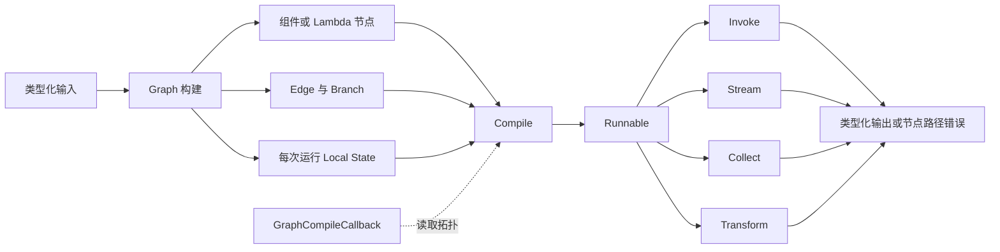

# Eino Compose L3 学习协议

## 当前状态

| 项目 | 值 |
|---|---|
| 学习工作区 | 仓库根目录 |
| 源码来源 | `module`：`github.com/cloudwego/eino@v0.9.12`；官方示例仓库作为辅助证据 |
| 框架版本 | Eino `v0.9.12`，commit `13e1a25c7238293a1e558391a65525a464acb324` |
| 目标等级 | L3：扩展定制 |
| 当前阶段 | 后续单变量迁移：接入 ChatModel 回复生成器 |
| 当前决策门 | 决策门 3：已通过，进入组件集成学习 |
| 最近更新 | 2026-07-21 |

## 输入解析

| 字段 | 解析结果 | 说明 |
|---|---|---|
| `workspace` | 当前仓库 | 沿用现有 Eino 学习工作区 |
| `source` | `module` | 从根 `go.mod` 解析当前项目实际使用的版本 |
| `module` | `github.com/cloudwego/eino@v0.9.12` | 不改用远程 `main` 或 `v0.10.0-alpha` |
| `target_level` | L3 | 承接已通过的 Eino L2，主题为 Compose 确定性编排 |
| `mode` | `execute` | 用户已授权开始学习，但仍遵守三个决策门 |
| `output` | `docs/learning/eino/compose/` | 与已完成的 Eino L2 产物分离 |

## 目标变更影响

- `建议` 保留 [Eino L2 协议](../learning-protocol.md) 的完成状态，不把新主题回写成 L2 未完成。
- `已验证` 根模块已锁定 Eino `v0.9.12`，本轮不升级 Go、Eino 或 EinoExt。
- `建议` 复用 L2 已掌握的 Callback、错误链和流所有权结论，但 Compose 的 Graph 构建、状态、分支和编译扩展必须单独验证。
- `建议` L3 首个扩展聚焦 `GraphCompileCallback` 拓扑观测，不同时引入 checkpoint、Agent Tool、多 Agent 或真实模型服务。

## 学习目标

- 目标能力：能为确定性业务控制流选择 Graph、Chain 或 Workflow，并解释选择依据。
- 目标能力：能构建包含类型化节点、显式分支、受控循环、每次运行本地状态和节点错误定位的 Graph。
- 目标能力：实现一个自定义 `GraphCompileCallback` 拓扑观测扩展，并验证其在嵌套 Graph 和并发编译场景下的兼容边界。
- 完成定义：官方完整示例实际运行；自定义纵向项目覆盖正常路径和三类故障；扩展实现、回归测试、源码链路和单变量迁移均有实际证据。
- 不在范围：Compose checkpoint/恢复、Graph 暴露为 Agent Tool、RAG、多 Agent、生产部署和容量评估；真实模型调用作为 L3 通过后的单变量迁移继续学习。

## 业务场景调整

当前纵向项目采用“AI 客服回复发布前审核”作为业务背景：先模拟客服生成回复草稿，再进入质量门禁；在掌握 Compose 编排后，再逐个替换为真实模型能力。

```text
用户问题
  -> 模拟客服生成回复草稿
  -> QualityGate 审核
     -> 有问题：修改后重新审核
  -> CustomerReplyDelivery
     -> 通过：模拟发送回复
     -> 多次失败：模拟进入人工队列
```

- 第一阶段：模拟客服生成确定性草稿，使用离线规则审核，不依赖网络或凭据。
- 第二阶段：只将模拟客服替换为真实 ChatModel，保持审核 Graph 和 Inspector 不变。`已实现` 默认模拟模式保持离线可运行，显式设置 `CUSTOMER_REPLY_MODE=model` 时调用 EinoExt OpenAI ChatModel。
- 第三阶段：只将离线 Inspector 替换为真实模型或内容审核 API，保持 Graph 拓扑不变。
- 第四阶段：只将模拟交付组件替换为真实消息通道和人工审核队列。
- 每次迁移只改变一个外部能力，分别验证输入、错误传播、拓扑和运行结果。

## 版本基线

| 对象 | 版本/位置 | 依据 | 状态 |
|---|---|---|---|
| Eino 模块 | `github.com/cloudwego/eino v0.9.12` | 根 `go.mod`、`go.sum`、`go list -m` | 已验证 |
| Eino 源码 | 本机 Go 模块缓存；tag commit `13e1a25c...` | L2 版本基线与当前模块解析结果 | 已验证 |
| 当前 Go | `go1.26.3 darwin/arm64` | `go env GOVERSION GOOS GOARCH` | 已验证 |
| 根模块 Go directive | `go 1.26.0` | 根 `go.mod` | 已验证 |
| 官方示例 | commit `171220631fb7068ead50b7cd964b8c471647117d` | 示例根 `go.mod` 精确依赖 Eino `v0.9.12` | 已验证版本匹配 |
| 官方文档 | Eino `v0.9.12` tag README | Composition Quick Start 与同版本源码一致 | 已验证版本匹配 |

## 框架定位卡

- 官方定位：`官方说明` Compose 把组件连接成可独立运行或暴露为 Agent Tool 的 Graph/Workflow；需要精确控制执行流时使用。
- 框架类别：AI 组件与确定性编排子系统。
- 目标用户：需要用 Go 类型、显式拓扑和可替换组件表达受控 AI/业务流程的工程团队。
- 核心问题：统一节点契约和数据流范式，编译并调度非线性拓扑，管理分支、循环、本地状态、回调和节点错误路径。
- 适用场景：步骤和分支规则由应用确定、需要类型检查和跨节点诊断、或需要把模型组件嵌入确定性流程的场景。
- 不适用场景：单个函数调用、纯线性且无需框架观测的小流程，或完全由模型自主决定下一步的 Agent 主循环。
- 不使用 Compose 的替代成本：应用需自行实现拓扑校验、节点调度、流式范式适配、运行级状态隔离、循环上限、回调传播和节点路径错误包装。

## 主流设计

详细说明见 [architecture.md](architecture.md)。



### Graph、Chain 与 Workflow

| 构建器 | 主要形态 | 关键约束 | 本轮角色 |
|---|---|---|---|
| Graph | 显式节点、边、分支和循环 | 默认 `AnyPredecessor`，应用负责拓扑和循环上限 | 推荐主路径 |
| Chain | 顺序 builder，可嵌入并行和分支 | 底层仍构建 Graph，适合以线性为主的流程 | 边界对照 |
| Workflow | 依赖声明和字段映射的 DAG | 固定 `AllPredecessor`，不支持循环 | 边界对照 |

### 核心机制

| 机制 | 为什么定义 Compose 身份 | 主路径位置 | 删除后的退化形态 |
|---|---|---|---|
| 类型化 Graph 与编译 | 在运行前聚合节点、边、分支和类型约束 | `NewGraph` 到 `Compile` | 手写函数串联，错误延迟到运行期 |
| `Runnable` 四种数据流范式 | 统一单值和流式输入输出，并适配节点能力 | 编译产物到调用入口 | 每种模式单独维护管线 |
| Branch、循环和最大步数 | 表达确定性非线性控制流并限制失控循环 | Graph 运行期 | 手写 while/switch 和计数器 |
| Local State | 提供每次运行隔离、互斥访问和嵌套作用域 | 节点前后处理与 Branch | 全局变量或不安全闭包状态 |
| Callback 与节点路径错误 | 从拓扑层定位失败节点并保留原始错误链 | 节点执行和错误返回 | 只能看到无上下文的底层错误 |
| `GraphCompileCallback` | 向扩展暴露编译后的拓扑元数据 | Compile 完成时 | 观测器需侵入业务 Graph 构建代码 |

### 责任边界

| 层级 | 负责 | 不负责 |
|---|---|---|
| Compose | 拓扑、类型与字段映射校验、调度、数据流适配、本地状态、回调和错误路径 | 业务规则正确性、持久化状态、外部依赖 SLA |
| Eino 组件/EinoExt | ChatModel、Tool、Retriever 等节点的实际能力 | 决定业务分支和 Graph 生命周期 |
| 应用 | 输入输出类型、节点实现、Branch 规则、循环退出、超时、错误语义和幂等性 | 复制 Compose 内部调度器或依赖 `internal` 包 |
| 外部基础设施 | 模型、数据库、HTTP 服务、日志与 Trace 后端 | Graph 拓扑和本地状态一致性 |

## 主路径证据

详细证据见 [evidence.md](evidence.md)。

| 结论 | 独立证据 | 置信度 | 状态 |
|---|---|---|---|
| 精确控制流优先使用 Compose Graph | tag README、`NewGraph`/`Compile` 源码、官方 Graph 示例 | 高 | 已验证设计意图和源码 |
| Graph 编译为统一 `Runnable` | `generic_graph.go`、`runnable.go` | 高 | 已验证源码 |
| Workflow 不适合本轮受控循环 | `workflow.go` 明确使用 `AllPredecessor` 且不支持循环 | 高 | 已验证源码 |
| Local State 是运行级共享状态，不是持久化状态 | `WithGenLocalState`、`ProcessState` 与状态测试 | 高 | 已验证源码和测试代码 |
| 编译回调适合观测但不能否决编译 | `GraphCompileCallback.OnFinish` 无错误返回值 | 高 | 已验证公开接口 |

## 决策门 1：版本与主路径

- 推荐版本：继续使用 Eino `v0.9.12` 与 Go `1.26.3`，不升级依赖。
- 推荐主路径：以 `Graph -> Compile -> Runnable.Invoke` 为第一条路径，覆盖 Lambda、Branch、受控循环、Local State、`WithMaxRunSteps` 和节点错误路径。
- 官方基线：选择 `eino-examples/compose/graph/state`，因为它无外部凭据且同时覆盖状态、分支、循环和最大步数。
- L3 扩展：实现请求级安全的拓扑快照器，使用每次编译注入的 `GraphCompileCallback`，不使用全局回调保存可变状态。
- 纵向项目候选：可审计内容质量门禁 Graph，使用可替换 `Inspector` 依赖、补救循环和人工复核分支。
- 选择依据：该范围能触发 Compose 的非线性编排价值，并能验证一个真实公开扩展点，不会退化成 Lambda 串联示例。
- 主要争议：Chain 更简洁但不适合作为显式循环主线；Workflow 的字段映射更强但源码明确不支持循环；checkpoint 属于持久恢复能力，本轮不与 Local State 混学。
- 证据校正：官方 state 示例关于“闭包不能访问 Branch 状态”的注释不是 Go 语法事实；本协议只采用可由源码证实的运行隔离、互斥访问和嵌套作用域结论。
- 扩展限制：`GraphCompileCallback` 没有错误返回值，只能观测，不能作为阻止 Graph 编译的策略门禁。
- 用户决定：确认按原计划使用 Graph 主路径和内容质量门禁纵向项目；Obsidian RAG 仅作为问答讨论，不纳入本轮范围。
- 确认日期：2026-07-19。

## 官方完整示例

- 示例位置：`cloudwego/eino-examples/compose/graph/state`，commit `171220631fb7068ead50b7cd964b8c471647117d`。
- 选择原因：使用 `NewGraph`、`WithGenLocalState`、State Pre/Post Handler、`ProcessState`、Branch、循环和 `WithMaxRunSteps`，不依赖模型或外部服务。
- 前置条件：Go `1.24.7` 或更高；可读取 Eino `v0.9.12` 依赖；无需凭据。
- 可复现命令：

```bash
export EINO_EXAMPLES_DIR="${TMPDIR:-/tmp}/eino-examples-v0.9.12"
git clone https://github.com/cloudwego/eino-examples.git "$EINO_EXAMPLES_DIR"
git -C "$EINO_EXAMPLES_DIR" checkout 171220631fb7068ead50b7cd964b8c471647117d
go -C "$EINO_EXAMPLES_DIR" run ./compose/graph/state
```

- 预期结果：翻译和审校运行两轮；Local State 记录轮次与历史；质量分支第二轮选择 `END`；最终输出包含两次审校痕迹。
- 实际命令：

```bash
export EINO_EXAMPLES_DIR="${TMPDIR:-/tmp}/eino-examples-v0.9.12"
export GOCACHE="${TMPDIR:-/tmp}/eino-compose-gocache"
go -C "$EINO_EXAMPLES_DIR" run ./compose/graph/state
```

- 实际结果：`已验证` 示例退出码为 0。第一轮 `round=1`、质量 `5/10`，Branch 回到 `translate`；第二轮 `round=2`、质量 `7/10`，Branch 进入 `END`；最终结果包含第一轮历史和第二轮审校结果。
- 环境说明：首次运行因沙箱不能写默认 Go 构建缓存而失败；将 `GOCACHE` 指向临时目录后，示例逻辑正常运行。该失败不属于 Compose 行为。

## 最小完整纵向项目

- 原生场景：AI 客服回复发布前的可审计质量门禁 Graph。
- 业务目标：模拟客服先生成回复草稿；质量门禁调用可替换 `Inspector` 评分；低分进入补救节点并重新检查，达到阈值后允许发送，达到最大尝试次数后转人工复核。
- 主链路：`START -> validate -> inspect -> Branch -> remediate/approve/manual -> END`，其中 `remediate -> inspect` 形成受控循环。
- 框架身份机制：类型化 Graph、Lambda、Branch、Local State、最大步数、per-run Callback、节点错误路径和自定义编译回调。
- 外部边界：模拟客服生成器、`Inspector` 和 `CustomerReplyDelivery`；默认测试使用确定性实现，不访问真实模型或网络。
- L3 扩展：自定义拓扑快照器从 `GraphInfo` 复制 Graph 名称、节点、边和分支摘要；不保留节点实例和可变 Graph 引用。
- 异常候选：空内容业务错误、检查超时、Inspector 不可用、循环超过最大步数。
- 代码目录：[examples/compose-quality-gate/](../../../../examples/compose-quality-gate/)。

### 正常路径

```text
ReviewRequest
-> validate
-> inspect
-> Branch
   -> approve -> ReviewResult(status=approved) -> 模拟发送给用户
   -> remediate -> inspect（有界循环）
   -> manual -> ReviewResult(status=manual_review) -> 模拟进入人工队列
```

- `validate`：拒绝空白内容，生成运行负载。
- `inspect`：调用 `Inspector`，写入评分、原因和运行级审计轨迹。
- `Branch`：分数达到阈值时进入 `approve`；未达到阈值且仍有尝试次数时进入 `remediate`；达到尝试上限时进入 `manual`。
- `remediate`：执行确定性补救并回到 `inspect`，不直接绕过复检。
- `approve/manual`：读取 Local State，返回最终状态、尝试次数和审计摘要。

### 框架机制与使用位置

| Compose 机制 | 使用位置 | 验证重点 |
|---|---|---|
| 类型化 `Graph` 与 Lambda | 全部业务节点 | 编译期输入输出类型和拓扑校验 |
| `GraphBranch` | `inspect` 后 | 只能选择已声明目标；通过、补救、人工三路互斥 |
| 有界循环 | `remediate -> inspect` | 业务尝试上限和 `WithMaxRunSteps` 双重保护 |
| Local State | 尝试次数、审计轨迹 | 单次运行内共享；并发调用互相隔离 |
| `Runnable.Invoke` | 示例入口与测试 | 相同编译产物可重复、并发调用 |
| 节点路径错误 | `validate`、`inspect` | `errors.Is` 保留根因，同时错误文本包含节点路径 |
| `GraphCompileCallback` | `Compile` | 生成稳定、不可变的拓扑快照 |

### 外部边界与替代实现

| 边界 | 默认实现 | 替代实现 | 本轮选择 |
|---|---|---|---|
| 回复生成 | 确定性模拟客服函数 | 真实 ChatModel | 先使用模拟实现，后续单变量替换 |
| `Inspector` | 测试可控的 scripted inspector | 真实 ChatModel 或内容审核服务 | 默认完全离线，阶段 6 只替换这一项 |
| 内容补救 | 确定性 Lambda | 模型改写服务 | 保持本轮变量单一，不引入第二个外部依赖 |
| 结果交付 | 模拟 `CustomerReplyDelivery` | 消息通道和人工审核队列 | 覆盖发送与转人工两个终态，后续单变量替换 |
| 审计存储 | Local State 随结果返回 | 数据库或事件流 | 只验证运行级状态，不冒充持久化 |

### 故障与可观测性

| 场景 | 注入位置 | 预期行为 | 证据 |
|---|---|---|---|
| 超时 | `Inspector.Inspect` 等待 `ctx.Done()` | `context.DeadlineExceeded` 可由 `errors.Is` 识别，错误包含 `inspect` 节点路径 | 单元测试 |
| 业务错误 | `validate` 收到空白内容 | 返回稳定的 `ErrEmptyContent`，不调用 Inspector | 单元测试与调用计数 |
| 依赖不可用 | `Inspector` 返回 `ErrInspectorUnavailable` | 不重试、不伪装成功，保留根因和节点路径 | 单元测试 |
| 循环失控 | 持续低分且业务上限高于 Graph 步数上限 | 返回 `compose.ErrExceedMaxSteps` | 边界测试 |

- 运行期观测：结果中的尝试次数和审计摘要、节点级 Callback 事件、可解包错误链。
- 编译期观测：拓扑快照包含 Graph 名称、排序后的节点、边和分支目标，不保留节点实例。
- 并发边界：同一个 `Runnable` 并发调用，使用 `go test -race` 验证 Local State 和快照读取没有数据竞争。

### 保留与省略

| 能力 | 决定 | 理由 |
|---|---|---|
| Graph、Branch、循环、Local State | 保留 | 直接定义本轮 Compose 学习价值 |
| 最大运行步数和错误链 | 保留 | 覆盖失控保护和诊断能力 |
| 编译拓扑快照扩展 | 保留 | 满足 L3 真实公开扩展验收 |
| 真实 ChatModel | L3 后续迁移 | 只替换回复生成器；默认测试继续使用 scripted ChatModel，不访问网络 |
| 真实审核 API | 省略 | 保持 Graph 内 Inspector 确定，避免一次改变两个外部能力 |
| checkpoint/恢复和持久化审计 | 省略 | 与 Local State 是不同问题，应单独学习 |
| Stream、Agent Tool、RAG、多 Agent | 省略 | 不属于当前纵向项目的必要主链路 |
| HTTP 服务和生产部署 | 省略 | 使用模拟交付完成业务闭环，但不冒充真实网络发送和生产部署 |

### 计划验证命令

```bash
gofmt -w examples/compose-quality-gate/*.go
go test ./examples/compose-quality-gate
go test -race ./examples/compose-quality-gate
go test ./...
go vet ./...
go run ./examples/compose-quality-gate
```

## 决策门 2：纵向项目范围

- 推荐范围：模拟客服生成回复草稿，再使用离线、可审计的内容质量门禁 Graph，最后模拟发送或进入人工队列；保留 scripted `Inspector`、确定性补救、三路 Branch、有界循环、Local State 和拓扑快照器。
- 取舍依据：先让业务输入真实存在，再学习 Compose 的非线性调度、状态隔离、循环保护、错误路径和公开扩展点；真实模型通过单变量迁移引入，避免网络和模型输出掩盖编排问题。
- 用户决定：确认先模拟客服，掌握 Compose 后再替换为真实模型。
- 确认日期：2026-07-20。

## 执行阶段

| 阶段 | 状态 | 产物 | 验证 |
|---|---|---|---|
| 0. 版本基线 | 已完成 | 本协议、`evidence.md` | `go.mod`、`go.sum`、`go list -m`、示例 commit |
| 1. 第一版全景图 | 已完成 | `architecture.md`、`evidence.md` | 决策门 1 |
| 2. 官方完整示例 | 已完成 | 本协议运行记录 | 官方 state 示例退出码 0 |
| 3. 纵向项目设计 | 已完成 | 本协议 | 决策门 2 |
| 4. 运行闭环与扩展 | 已完成 | 示例代码、故障矩阵 | 测试、竞态检测、vet |
| 5. 源码链路 | 已完成 | `runtime-path.md`、`source-map.md` | 文件与符号引用 |
| 6. 单变量迁移 | 已完成 | 迁移预测与结果 | 回归测试 |
| 7. L3 验收与巩固 | 进行中 | 验收记录、苏格拉底式问答 | 决策门 3 |

## L3 验收标准

| 验收项 | 当前状态 | 最低证据 |
|---|---|---|
| Graph 主路径可解释 | 已确认 | 决策门 1、架构和责任边界 |
| 官方完整示例可运行 | 已验证 | 官方 state 示例实际输出 |
| 自定义 Graph 正常路径 | 已验证 | `go test ./examples/compose-quality-gate`、示例运行 |
| 三类故障可诊断 | 已验证 | 空内容、超时、依赖不可用、非法评分和超步数测试 |
| L3 扩展已实现 | 已验证 | `TopologySnapshotter`，嵌套 Graph、稳定排序和并发编译测试 |
| 源码链路已核对 | 已验证 | `runtime-path.md`、`source-map.md` |
| 单变量迁移已完成 | 已验证 | `TestQualityGateInspectorMigrationKeepsGraphTopology` |
| 能独立解释并预测运行行为 | 巩固中 | 苏格拉底式问答：控制流、状态、错误传播、扩展边界 |

## 决策门 3：L3 验收

- 推荐结论：当前实现已达到 Compose L3“扩展定制”的学习验收标准。
- 实际验证：官方 state Graph 示例、纵向项目正常路径、三类核心故障、循环保护、并发状态隔离、拓扑快照扩展、源码链路和 Inspector 单变量迁移均已运行验证。
- 验证命令：`go test ./...`、`go test -race ./examples/compose-quality-gate`、`go vet ./...`、`go run ./examples/compose-quality-gate` 均通过；示例包额外连续运行测试 10 次通过。
- 本次复核：`已验证` 2026-07-21 重新执行上述全部命令，退出码均为 0；示例输出为 `status=approved score=8 attempts=2`，拓扑摘要为 5 个节点、5 条边、1 个分支。
- 生产边界：该结论只代表掌握 Compose 主路径和公开扩展点，不代表真实审核依赖、持久化、容量、部署、回滚或灾备已经生产就绪。
- 用户验收：通过；用户确认已基本理解 Compose 流程，并授权进入真实 ChatModel 接入阶段。
- 验收日期：2026-07-21。

## 苏格拉底式巩固

- 目标：不依赖背诵文档，能够从输入和配置预测 Graph 的节点路径、状态变化、错误链和扩展行为。
- 顺序：控制流与数据流 -> Local State 与并发边界 -> 错误与取消传播 -> Callback 与拓扑扩展 -> 单变量迁移。
- 方式：每轮先给出场景、相关文件和足够回答问题的最小代码片段，再只讨论一个关键问题；先由用户解释，再根据回答追问假设、反例或源码证据，不假定用户记得示例实现，也不直接公布整章答案。
- 当前沉淀：已新增 [核心概念笔记](core-concepts.md)，集中说明 Lambda、Edge、Branch、Local State，以及包装、注册、挂载、编译和运行的职责边界与设计原因。
- 当前掌握：已能区分节点注册与拓扑连接、固定 Edge 与条件 Branch、同一次运行与两次 Review 的状态边界；错误与取消传播暂缓，优先巩固 Compose 自身的构建和运行原理。
- 重新验收：已完成。后续通过 ChatModel 单变量迁移继续检验组件边界理解。

## ChatModel 单变量迁移

- `建议` 迁移目标：把 `simulatedCustomerReplyGenerator` 替换为基于 `model.BaseChatModel` 的实现，不修改 QualityGate 的节点、Edge、Branch 或 Local State。
- `已验证` `NewChatModelCustomerReplyGenerator` 构造的适配器使用 System/User Message 调用 `BaseChatModel.Generate`，拒绝空问题和空模型响应，并用 `%w` 保留模型错误链。
- `已验证` CLI 默认选择 `simulated`，只有显式设置 `CUSTOMER_REPLY_MODE=model` 才创建 EinoExt OpenAI ChatModel，避免默认测试和本地运行产生网络调用。
- `已验证` scripted ChatModel 测试覆盖提示消息、模型错误、空响应、取消传播和环境配置；默认示例仍可离线运行。
- `待验证` 真实模型在线调用需要用户提供有效凭据和 OpenAI 兼容服务，本轮没有把未执行的在线冒烟标记为通过。
- `边界` 当前 ChatModel 位于审核 Graph 上游，不是通过 `AddChatModelNode` 注册的 Graph 节点；下一步将比较这两种组合方式。

## 问题债务

| 问题 | 当前结论 | 影响范围 | 验证方式 | 最晚阶段 |
|---|---|---|---|---|
| Graph 默认触发模式下多前驱 fan-in 的精确调度顺序 | 本项目只有单分支循环；fan-in 未纳入本轮 | 并行拓扑专题 | 后续单独运行多前驱 Graph/Workflow 实验 | 后续专题 |
| 编译回调在嵌套 Graph 中的元数据形态 | `GraphNodeInfo.GraphInfo` 暴露嵌套信息，快照测试已验证 | 拓扑快照扩展 | 阶段 4 单元测试和源码核对 | 已解决 |
| Local State 与流式 Handler 的物化边界 | 非流式 State Handler 会合并流 | 后续流式迁移选择 | 单独执行 Stream State Handler 实验 | 后续流式专题 |

## 产物索引

- [证据表](evidence.md)
- [架构全景](architecture.md)
- [核心概念：Lambda、Edge、Branch 与 Local State](core-concepts.md)
- [运行链路](runtime-path.md)
- [故障矩阵](failure-matrix.md)
- [源码导航](source-map.md)

## 下一步

运行一次真实 ChatModel 冒烟，然后比较“Graph 外直接调用 `BaseChatModel.Generate`”与“Graph 内使用 `AddChatModelNode`”的数据类型、回调范围和错误路径。
