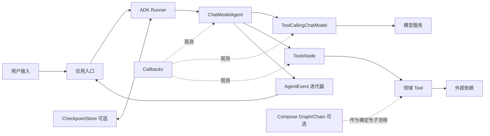

# Eino 学习协议

## 当前状态

| 项目 | 值 |
|---|---|
| 学习工作区 | 仓库根目录 |
| 源码来源 | `repository`：`https://github.com/cloudwego/eino` |
| 框架版本 | 已确认 `v0.9.12`，commit `13e1a25c7238293a1e558391a65525a464acb324` |
| 目标等级 | L2：运行与诊断 |
| 当前阶段 | 阶段 4：运行闭环已完成；下一步阶段 5 |
| 当前决策门 | 决策门 2 已通过 |
| 当前能力等级 | L1 已验收，L2 尚未验收 |
| 最近更新 | 2026-07-15 |

## 输入解析

| 字段 | 解析结果 | 说明 |
|---|---|---|
| `workspace` | 当前仓库 | 学习产物写入本仓库 |
| `source` | `repository` | 用户提供 Eino 官方仓库链接 |
| `ref` | `v0.9.12` | 用户已在决策门 1 确认最新非预发布 tag |
| `target_level` | `L2` | 用户明确指定 |
| `mode` | `execute` | 用户确认决策门 1，并授权推进下一未完成阶段 |
| `output` | `docs/learning/eino/` | 遵循学习文档目录约定 |

## 学习目标

- 目标能力：能独立构建并运行一个 `ChatModelAgent + Tool + Runner` 纵向示例，能用事件、回调、错误链和源码定位模型、工具及流式消费之间的常见故障。
- 目标能力：能解释 ADK、标准组件接口、Compose、Schema/Stream、Callbacks 与 EinoExt 的责任边界。
- 完成定义：官方基线实际运行；自定义纵向项目正常路径可运行；超时、业务错误、依赖不可用均有测试和观测证据；完成一次端到端源码追踪与一次单变量迁移测试。
- 不在范围：DeepAgent、多 Agent 编排、RAG/索引、长期记忆、生产部署、容量与安全评估。它们不影响本轮验证 Eino 的 Agent、Tool、Runner、回调及流式主路径。

## 版本基线

| 对象 | 版本/位置 | 依据 | 状态 |
|---|---|---|---|
| Eino 源码 | `v0.9.12` / `13e1a25c7238293a1e558391a65525a464acb324` | 官方 Git tag 与临时浅克隆 HEAD 一致；commit 日期 2026-06-29 | 已验证并确认采用 |
| Eino Go 要求 | `go 1.18` | `v0.9.12/go.mod` 与 README 一致 | 已验证 |
| 学习项目目标 Go | `Go 1.26.3` | 用户确认使用 Go 1.26；当前 shell 实测为 `go1.26.3` | 已验证 |
| 当前 shell Go | `go1.26.3 darwin/arm64` | 2026-07-15 实际执行 `go version` | 已验证；与用户确认一致 |
| 官方示例仓库 | commit `171220631fb7068ead50b7cd964b8c471647117d` | 根模块依赖 Eino `v0.9.12`，commit 日期 2026-06-30 | 已验证 |
| 官方示例 Go 要求 | `go 1.24.7` | 上述示例仓库根 `go.mod` | 已验证；当前 Go 1.26.3 满足要求 |
| 官方文档 | `v0.9.12` 仓库 README；官网滚动文档仅作辅助 | tag 内 README 与同版本源码一致；官网未见版本锁定入口 | 前者已验证，官网内容待阶段 2 逐项核对 |
| EinoExt 模型实现 | OpenAI `v0.1.13` | 官方示例仓库根 `go.mod`；决策门 2 | 已确认纵向项目采用 |

版本选择原则：默认选择最新非预发布 tag `v0.9.12`。官方 refs 中虽已有 `v0.10.0-alpha.1` 至 `v0.10.0-alpha.12`，但预发布 API 变化会削弱 L2 学习结果的可复现性，因此不推荐作为第一条学习主线。

## 框架定位卡

- 官方定位：`官方说明` Eino 是遵循 Go 习惯的 LLM 应用开发框架，提供组件抽象、Agent Development Kit、组合编排、流处理、回调和中断恢复机制。
- 框架类别：AI 组件与编排框架；本轮主类别是 Agent 编排，Compose 是确定性控制流能力。
- 目标用户：希望用 Go 构建 Agent、工具调用、确定性 AI 工作流或可替换模型/检索组件的工程团队。
- 核心问题：统一模型、工具等组件接口；管理 Agent/工具运行循环；在编排中适配同步与流式范式；提供回调、事件、中断和检查点等横切机制。
- 适用场景：需要工具调用、Agent 生命周期、可组合工作流、流式输出或跨组件诊断的 Go AI 应用。
- 不适用场景：只有一次无编排的模型调用时，直接使用模型 SDK 通常更小；需要跨语言统一运行时或完整生产平台能力时，Eino 本身也不是全部解决方案。
- 不使用框架时的替代成本：应用需自行定义组件契约、ReAct 循环、工具 schema 与调度、流转换、事件模型、回调传播、取消及中断恢复。

## 主流设计

推荐主路径如下，详细说明见 [architecture.md](architecture.md)：



### 核心机制

| 机制 | 为什么定义框架身份 | 在主路径中的位置 | 删除后的退化形态 |
|---|---|---|---|
| 标准组件接口 | 模型与工具可替换，并由编排层统一调用 | `ToolCallingChatModel`、`InvokableTool`/`StreamableTool` | 直接耦合厂商 SDK 和业务函数 |
| `ChatModelAgent` ReAct 循环 | 在模型决策、工具执行和再次生成之间建立 Agent 主循环 | Runner 内部的 Agent 实现 | 应用手写 while/switch 工具循环 |
| `Runner` 与 `AgentEvent` | 统一启动、恢复、检查点、取消和事件输出 | 应用与 Agent 之间 | 应用直接调用 Agent 并自行管理生命周期 |
| Compose 与 `Runnable` | 用类型化 Graph/Chain/Workflow 表达确定性控制流，并适配四种数据流范式 | 可作为独立流程或 Agent Tool 的内部实现 | 手写步骤串联、分支与流转换 |
| Schema/Stream | 统一消息、工具调用和流式读写 | 模型、Agent、工具和入口之间 | 各组件自行转换厂商对象与 channel |
| Callbacks | 在组件固定时点注入日志、Trace 和指标 | 横跨 Agent、模型、工具和 Compose 节点 | 观测代码散落到业务实现 |

### 责任边界

| 层级 | 负责 | 不负责 |
|---|---|---|
| Eino 核心 | Schema/Stream、组件接口、Compose、ADK、回调、中断/检查点契约 | 具体模型服务、业务规则、凭据管理、生产部署 |
| EinoExt | OpenAI、Ark、Ollama 等组件实现及部分回调/开发工具 | 应用领域策略与错误语义 |
| 应用 | Agent 指令、工具 schema、业务校验、超时策略、事件到接口响应的映射 | 复制 Eino 内部实现或依赖其 `internal` 包 |
| 底层协议/库 | HTTP、SSE、模型厂商协议、JSON schema 等传输与编码 | Agent 决策与业务编排 |
| 外部基础设施 | 模型端点、领域服务、检查点存储、日志/Trace 后端 | 应用内的工具选择和错误映射 |

## 主路径证据

详细证据见 [evidence.md](evidence.md)。

| 结论 | 独立证据 | 置信度 | 验证状态 |
|---|---|---|---|
| `v0.9.12` 是当前已确认的最新非预发布 tag | 官方 Git refs、tag 浅克隆 HEAD | 高 | 已验证 |
| 当前推荐入口是 `ChatModelAgent + Runner`，Tool 触发 ReAct | tag README、`adk/runner.go`、`adk/chatmodel.go`、官方示例、纵向项目 | 高 | 源码、官方示例和自定义项目均已验证 |
| Compose 用于需要精确控制的 Graph/Workflow | tag README、`compose.Runnable` 与 `Graph.Compile` | 高 | 源码已验证，运行待验证 |
| Callbacks 覆盖组件生命周期，但流读取期错误不会进入 `OnError` | callbacks 包文档与接口源码 | 高 | 源码已验证，故障实验待执行 |

## 决策门 1：版本与主路径

- 推荐版本：Eino `v0.9.12`，不选 `v0.10.0-alpha.12`。
- 推荐运行时策略：学习项目与运行验证统一使用当前实测的 Go `1.26.3`。Eino 核心声明最低 Go `1.18`，官方示例仓库要求 Go `1.24.7`，当前工具链同时满足两者。
- 推荐主路径：先学习 `ChatModelAgent -> Tool -> Runner -> AgentEvent/Callbacks`；Compose 先建立边界理解，在迁移测试中单独验证流式运行模式，不同时引入多 Agent、RAG 和持久化。
- 选择依据：这是 `v0.9.12` README 的首个 Quick Start，源码中 Runner 明确标为 Agent 的主执行入口，官方示例也使用同一组合；范围足以覆盖 L2 异常传播和诊断。
- 主要争议：Eino 历史上以 Compose 为核心，但 `v0.9.12` 已把 ADK Agent 放在 Quick Start 首位；本协议选择“ADK 为学习主线、Compose 为受控扩展”，避免把 Eino 学成单纯 Graph 库或单次模型 SDK。
- 运行时结论：用户已确认使用 Go 1.26，当前 shell 实测为 Go 1.26.3，无工具链阻塞。
- 用户决定：确认采用 Eino `v0.9.12`、Go `1.26.3` 与 ADK Agent 主路径。
- 确认日期：2026-07-15。

## 官方完整示例

- 示例：`cloudwego/eino-examples/adk/intro/chatmodel`，锁定 commit `171220631fb7068ead50b7cd964b8c471647117d`。
- 选择原因：它同时使用 `ChatModelAgent`、两个 Tool、`Runner.Query`、事件迭代器、内存 CheckpointStore、Interrupt/Resume，能覆盖主路径而不是一次裸模型调用。
- 版本匹配：示例仓库根模块精确依赖 Eino `v0.9.12`。
- 前置条件：Go `1.24.7` 或可自动选取兼容工具链；OpenAI 兼容或 Ark 模型凭据；可访问模型端点；交互式标准输入。
- OpenAI 变量：`OPENAI_API_KEY`、`OPENAI_MODEL` 必填，`OPENAI_BASE_URL` 按服务端点配置；不要把值写入仓库。
- Ark 变量：`MODEL_TYPE=ark`、`ARK_API_KEY`、`ARK_MODEL` 必填，`ARK_BASE_URL` 按服务端点配置。
- 可复现命令：

```bash
export EINO_EXAMPLES_DIR="${TMPDIR:-/tmp}/eino-examples-v0.9.12"
git clone https://github.com/cloudwego/eino-examples.git "$EINO_EXAMPLES_DIR"
git -C "$EINO_EXAMPLES_DIR" checkout 171220631fb7068ead50b7cd964b8c471647117d
go -C "$EINO_EXAMPLES_DIR" version
go -C "$EINO_EXAMPLES_DIR" run ./adk/intro/chatmodel
```

- 预期结果：Agent 先因输入信息不足触发澄清中断；用户输入偏好后从 checkpoint 恢复，调用图书搜索 Tool 并返回推荐结果。
- 构建结果：`已验证` 在 Go 1.26.3 下从锁定 commit 原样构建成功，产物为 arm64 Mach-O 可执行文件；依赖写入系统临时缓存，没有修改学习仓库依赖。
- 首次运行故障：`已验证` `.env` 的键与 `=` 之间存在空格，受控导入器未把这些行识别为合法环境变量，导致 EinoExt 收到空 `BaseURL` 并按源码回退到 `api.openai.com`，ChatModel 节点返回 HTTP `EOF`。删除键两侧空格后，自定义 BaseURL 被识别为有效非默认地址。
- 安全处理：`.env` 已被 `.gitignore` 忽略，权限从 `0644` 收紧为 `0600`；检查与运行过程没有输出密钥或自定义地址。
- 最终运行结果：`已验证` 使用自定义 OpenAI 兼容代理运行成功，进程退出码 0。事件依次覆盖 `Runner.Query`、`ask_for_clarification` Tool、Interrupt、用户补充条件、`Runner.Resume`、`search_book` Tool、Tool response 和最终回答。
- 固定补充输入：`sci-fi, maximum 400 pages, minimum rating 4`；`search_book` 收到 `genre=sci-fi`、`max_pages=400`、`min_rating=4`，返回官方示例内置的图书结果。

## 最小完整纵向项目

- 原生场景：可诊断的天气查询 Agent。
- 业务目标：用户输入城市，Agent 自主调用 `weather_lookup` Tool 获取天气并组织回答；在线 CLI 使用 EinoExt OpenAI 兼容模型，默认测试完全离线且可重复。
- 根模块：`github.com/wo4zhuzi/eino-lab`，Go directive 使用 `1.26.0`；直接依赖锁定 Eino `v0.9.12` 与 EinoExt OpenAI `v0.1.13`。
- 代码目录：`examples/diagnosable-weather-agent/`。
- 第一版运行模式：非流式；`RunnerConfig.EnableStreaming=false`。流式模式只在阶段 6 作为单变量迁移引入。
- 错误策略：Tool 返回原始错误并用 `%w` 补充上下文，ToolsNode 再按源码通过 `%w` 包装到 `AgentEvent.Err`；入口使用 `errors.Is` 分类。禁止使用 `WrapToolWithErrorHandler` 把错误转成普通 Tool 字符串，否则会掩盖 L2 错误传播。

### 正常路径

```text
CLI query
-> context.WithTimeout
-> EinoExt ToolCallingChatModel
-> adk.NewChatModelAgent
-> adk.NewRunner
-> Runner.Query
-> ChatModel 生成 weather_lookup ToolCall
-> ToolsNode
-> weather_lookup
-> WeatherProvider.Lookup
-> Tool message
-> ChatModel 生成最终回答
-> AgentEvent 迭代器
-> adk.GetMessage
-> CLI 输出
```

在线路径使用当前 `.env` 对应的 OpenAI 兼容服务；测试路径用 scripted `ToolCallingChatModel` 固定生成 ToolCall 和最终消息，确保测试不依赖模型随机性或网络。

### 文件布局

| 文件 | 责任 |
|---|---|
| `go.mod`、`go.sum` | 根模块、Go/Eino/EinoExt 精确依赖 |
| `examples/diagnosable-weather-agent/README.md` | 学习目标、版本、配置、运行命令、预期输出、限制 |
| `examples/diagnosable-weather-agent/main.go` | 环境配置、在线模型构造、CLI 参数、timeout、退出码 |
| `examples/diagnosable-weather-agent/agent.go` | Tool/Agent/Runner 装配、事件迭代与消息提取 |
| `examples/diagnosable-weather-agent/weather.go` | 输入输出、sentinel error、`WeatherProvider`、静态实现、`utils.InferTool` |
| `examples/diagnosable-weather-agent/observer.go` | per-run Callback、组件名/类型/阶段/耗时/错误日志，不记录输入输出正文 |
| `examples/diagnosable-weather-agent/weather_test.go` | Tool 与 Provider 的正常、校验、超时、不可用测试 |
| `examples/diagnosable-weather-agent/agent_test.go` | scripted ChatModel 驱动的离线 Agent 主链路、错误传播与回调断言 |

### 框架身份机制

| 机制 | 实际使用位置 | 验证目标 |
|---|---|---|
| `model.ToolCallingChatModel` | `main.go` 在线实现、`agent_test.go` scripted 实现 | 同一 Agent 装配可替换模型组件 |
| `utils.InferTool` | `weather.go` 构造 `weather_lookup` | Go struct 推导 Tool schema 并解码 JSON 参数 |
| `ChatModelAgent` ReAct | `agent.go` 配置 Model 与 ToolsConfig | 模型调用、ToolCall、Tool result、最终回答形成闭环 |
| `Runner.Query` / `AgentEvent` | `agent.go` | 生命周期与错误经事件通道返回应用入口 |
| `adk.GetMessage` | `agent.go` | 当前非流式可取消息，并为阶段 6 流式迁移保留统一入口 |
| per-run Callbacks | `observer.go`，通过 `adk.WithCallbacks` 注入 | 观测 Agent/ChatModel/Tool 的开始、结束、错误和耗时 |
| `context.Context` | `main.go` 到 Provider 全链路 | deadline/cancel 不被 Tool 或 Agent 截断 |

### 外部边界与替代实现

| 边界 | 在线/示例实现 | 测试替代 | 取舍 |
|---|---|---|---|
| ChatModel | EinoExt OpenAI `v0.1.13`，读取 OS 环境变量 | scripted `ToolCallingChatModel` | 在线验证真实组件；默认测试保持确定性 |
| WeatherProvider | 进程内静态天气数据 | success、blocking、unavailable 三种受控 Provider | 不引入真实天气 API，避免把 HTTP 集成噪声混入 Eino 主线 |
| 观测输出 | 标准库 `slog` | buffer/recording handler | 不绑定外部 Trace 平台，保留可断言日志 |

`WeatherProvider` 仍作为明确的可替换依赖边界。第一版不接真实天气 API，因为真实模型已经提供跨进程边界，而额外网络服务只会增加鉴权、限流和数据格式故障，不能提升本轮对 Eino ReAct 与错误传播的验证强度。

### 异常与迁移范围

| 项目 | 注入位置 | 预期验证 |
|---|---|---|
| 超时 | Runner 请求 context；blocking Provider 等待 `ctx.Done()` | `context.DeadlineExceeded` 经 Tool/ToolsNode 到 `AgentEvent.Err`，`errors.Is` 为真，Callback 定位 Tool |
| 业务错误 | Tool 输入为空或城市不受支持 | `ErrUnsupportedCity` 经 `%w` 保留，入口映射为业务失败，不生成伪成功回答 |
| 依赖不可用 | Provider 返回 `ErrWeatherUnavailable` | Agent 快速失败，`errors.Is` 为真，Callback 记录组件和错误类别但不记录参数 |
| 单变量迁移 | `RunnerConfig.EnableStreaming: false -> true` | Agent 与 Tool 契约不变；入口改为正确消费并关闭 message stream，验证流内错误不依赖 `OnError` 捕获 |

### 可观测点

- Callback `OnStart`：记录 `RunInfo.Component`、`Name`、`Type` 与开始时间；必须 nil-check `RunInfo`。
- Callback `OnEnd`：记录组件、成功状态和耗时；不记录 prompt、Tool 参数或完整模型输出。
- Callback `OnError`：记录组件、错误类别和耗时；不把它当作流读取期错误的唯一来源。
- AgentEvent：记录 `AgentName`、消息角色、`ToolName` 与 `Err`；入口必须逐个消费事件。
- 日志 handler 不修改 Callback 输入输出，不依赖多个 handler 的执行顺序，不使用全局 handler 保存可变请求状态。

### 测试层级

| 层级 | 用例 | 外部访问 | 核心断言 |
|---|---|---|---|
| Tool 单元测试 | 正常城市、空城市、不支持城市 | 无 | schema 解码、结果、`ErrUnsupportedCity` |
| Provider 单元测试 | 正常、blocking timeout、unavailable | 无 | context 响应、sentinel error |
| Agent 离线集成测试 | 正常 ReAct 两轮模型调用 | 无 | ToolCall、Tool response、最终 AgentEvent |
| Agent 故障测试 | timeout、业务错误、依赖不可用 | 无 | `AgentEvent.Err`、`errors.Is`、不产生最终回答 |
| Callback 测试 | Tool 成功与失败 | 无 | 组件、timing、耗时、错误均可观察且不含敏感字段 |
| 在线冒烟 | 当前 OpenAI 兼容模型 + 静态 Provider | 模型服务 | Agent 实际选择 Tool 并输出最终回答；不纳入默认测试 |

### 保留与省略

| 能力 | 保留/省略 | 理由 |
|---|---|---|
| Agent + Tool ReAct | 保留 | 定义本轮主路径 |
| Runner event 与 Callbacks | 保留 | L2 诊断必需 |
| 离线可控 ChatModel/Provider | 保留 | 默认测试可重复且无需凭据 |
| 流式迁移 | 保留 | 验证 Eino 数据流适配与资源关闭边界 |
| Interrupt/Resume | 阶段 2 官方示例验证，纵向项目省略 | 避免同时引入 checkpoint 状态，仍能从官方主路径观察该能力 |
| Compose Graph/Chain | 第一版项目省略 | 先控制变量；已在架构图保留，L2 后可作为下一学习主题 |
| Tool error 转字符串 | 省略 | 会隐藏 `AgentEvent.Err` 与错误链，不利于 L2 诊断 |
| Model retry/failover | 省略 | 会改变单次故障传播，待基础错误路径验证后再学习 |
| 真实天气 HTTP API | 省略 | 模型端点已提供外部边界，额外网络不增加 Eino 主路径覆盖 |
| 多 Agent、RAG、长期记忆 | 省略 | 不影响本轮 L2 验收，且会显著扩大故障面 |

### 阶段 4 验证命令

纵向项目实现并初始化模块后执行：

```bash
go mod tidy
gofmt -w examples/diagnosable-weather-agent/*.go
go test ./examples/diagnosable-weather-agent/... -run 'TestWeather|TestAgent' -count=1
go test -race ./examples/diagnosable-weather-agent/... -count=1
go test ./... -count=1
go vet ./...
go run ./examples/diagnosable-weather-agent "What is the weather in Beijing?"
```

前六条验证命令不得访问真实模型服务；最后一条是显式在线冒烟，需要预先把 `.env` 中的值导入当前进程环境，运行记录不得输出变量值。

### 阶段 4 实际结果

- 根模块已创建，直接依赖精确锁定 Eino `v0.9.12` 与 EinoExt OpenAI `v0.1.13`。
- scripted ChatModel 离线测试已验证两轮 ReAct：第一轮产生 `weather_lookup` ToolCall，第二轮收到匹配 `ToolCallID` 的 Tool message 后返回最终回答。
- `context.DeadlineExceeded`、`ErrUnsupportedCity`、`ErrWeatherUnavailable` 均经 Tool、ToolsNode 和 `AgentEvent.Err` 保留错误链，入口 `errors.Is` 断言通过。
- per-run Callback 能观测 Tool 成功与失败，并仅记录组件元数据、耗时和错误类别。
- `go test ./...`、`go test -race ./examples/diagnosable-weather-agent/...` 与 `go vet ./...` 均通过。
- 使用现有 `.env` 中的自定义 OpenAI 兼容代理完成在线冒烟：两次 OpenAI ChatModel 调用之间实际执行 `weather_lookup`，最终回答与静态 Provider 数据一致，退出码 0。
- 详细证据见 [failure-matrix.md](failure-matrix.md)。

## 决策门 2：纵向项目范围

- 推荐范围：批准上述单 Agent、单 Tool、单 Provider 的设计，先完成非流式正常路径和三类故障，再进入源码追踪与流式迁移。
- 推荐模块：`github.com/wo4zhuzi/eino-lab`，Go `1.26.0`，Eino `v0.9.12`，EinoExt OpenAI `v0.1.13`。
- 取舍依据：同时覆盖 Eino 的组件替换、ReAct、Runner event、Callback 和 context 错误传播，又把多 Agent、Compose、checkpoint、重试和第二个真实服务排除在第一版之外。
- 关键风险：在线模型是否选择 Tool 具有非确定性，因此只作为冒烟；L1/L2 的回归证据必须来自 scripted ChatModel 的离线测试。
- 实现授权：已确认，可创建 `go.mod`、`go.sum` 与 `examples/diagnosable-weather-agent/`。
- 用户决定：确认采用上述单 Agent、单 Tool、单 Provider、非流式第一版设计。
- 确认日期：2026-07-15。

## 执行阶段

| 阶段 | 状态 | 产物 | 验证 |
|---|---|---|---|
| 0. 版本基线 | 已完成 | 本协议、`evidence.md` | 官方 refs、tag 源码、`go.mod`、本机命令 |
| 1. 第一版全景图 | 已完成 | `architecture.md`、`evidence.md` | 决策门 1 已于 2026-07-15 通过 |
| 2. 官方完整示例 | 已完成 | 构建、故障诊断与成功运行记录 | 退出码 0；Tool、Interrupt、Resume 与最终回答均有实际输出 |
| 3. 纵向项目设计 | 已完成 | 本协议更新 | 决策门 2 已于 2026-07-15 通过 |
| 4. 运行闭环 | 已完成 | 示例代码、`failure-matrix.md` | 离线测试、竞态检测、vet、在线冒烟 |
| 5. 源码链路 | 待开始 | 运行链路、源码导航 | 文件、符号与调用关系 |
| 6. 单变量迁移 | 待开始 | 流式迁移预测与结果 | 修改前后回归测试 |
| 7. L2 验收 | 待开始 | 验收记录 | 决策门 3 |

## L2 验收标准

| 验收项 | 当前状态 | 所需证据 |
|---|---|---|
| 主路径可解释 | 已验证 | 架构图、责任边界、决策门 1 用户确认 |
| 官方基线可运行 | 已验证 | 锁定 commit 构建成功；官方示例完整链路退出码 0 |
| 纵向项目正常路径 | 已验证 | scripted ReAct 测试与自定义代理在线冒烟 |
| 超时可诊断 | 已验证 | `DeadlineExceeded` 错误链、Tool 失败 Callback 与事件断言 |
| 业务错误可诊断 | 已验证 | `ErrUnsupportedCity` 错误链与 `unsupported_city` 分类 |
| 依赖不可用可诊断 | 已验证 | `ErrWeatherUnavailable` 错误链与 `weather_unavailable` 分类 |
| 端到端运行/源码链路 | 待验证 | `runtime-path.md`、`source-map.md` |
| 单变量迁移 | 待验证 | 迁移前预测、流式测试与差异结论 |

当前推荐结论：阶段 0 至阶段 4 已完成，L1 已验收；尚未完成源码链路和流式迁移，因此 L2 未验收，更不能视为生产就绪。

## 问题债务

| 问题 | 当前假设 | 影响范围 | 验证方式 | 最晚解决阶段 |
|---|---|---|---|---|
| 官网滚动文档是否与 v0.9.12 完全一致 | 不能默认一致 | API 用法与主路径说明 | 逐项与 tag 源码、示例交叉核对 | 阶段 5 |
| 流式错误的观测策略 | 应从 StreamReader/AgentEvent 显式采集，不能只依赖 Callback `OnError` | L2 故障诊断 | 流内错误注入测试 | 阶段 6 |

## 产物索引

- [证据表](evidence.md)
- [架构图与责任边界](architecture.md)
- [阶段 4 故障矩阵](failure-matrix.md)
- `runtime-path.md`：阶段 5 开始时创建。
- `source-map.md`：阶段 5 开始时创建。

## 下一步

进入阶段 5：从在线已验证的 `Runner.Query` 请求沿实际调用链追踪到 ChatModel、ToolsNode、`weather_lookup` 和 `AgentEvent`，创建 `runtime-path.md` 与 `source-map.md`。阶段 5 不改变当前可运行代码。
