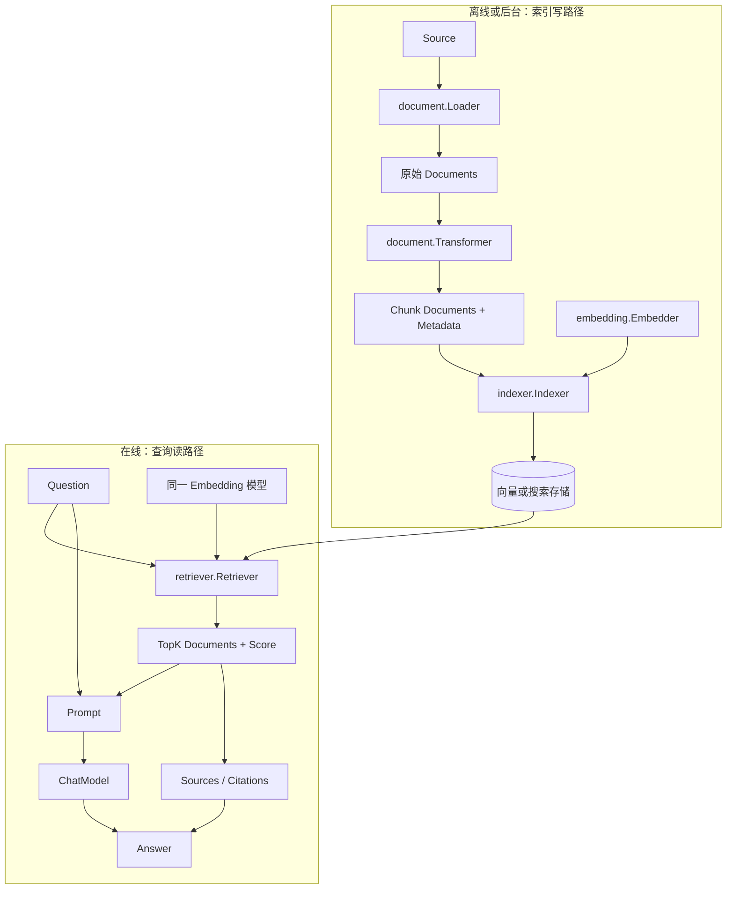

# Eino RAG v0.9.12 架构全景

## 版本限定

本文只描述当前项目锁定的 Eino `v0.9.12`。具体 EinoExt 组件版本、官方示例运行结果和自定义项目实现尚未在决策门 1 前确定。

## 一句话架构

`已验证` Eino 把 RAG 拆为共享 `schema.Document` 的索引写路径和查询读路径：应用与 EinoExt 提供资料解析、Embedding 和存储实现，Eino 核心提供组件契约、调用选项、高级 Flow 与 Compose 编排。

## 两条运行路径



索引写路径的产物是可复用索引，不是最终答案；查询读路径消费该索引，并把召回证据交给 ChatModel。把两条路径混在每次问答中会重复解析、Embedding 和写入，也会掩盖索引生命周期问题。

## `Document` 数据契约

`schema.Document` 包含：

```text
ID
Content
MetaData
```

RAG 中至少需要由应用约定以下元数据：

```text
source       原始文件或资料位置
chunk_id     稳定的切分标识
heading      标题或章节路径
```

Retriever 写入的分数应通过 `Document.WithScore`/`Score` 访问。Transformer 应保留上游元数据，否则回答即使召回正确，也无法形成可信引用。

## 核心组件

| 组件 | 公开输入 | 公开输出 | 责任 |
|---|---|---|---|
| `document.Loader` | `document.Source` | `[]*schema.Document` | 从文件、URL 等来源读取并解析资料 |
| `document.Transformer` | `[]*schema.Document` | `[]*schema.Document` | 切分、过滤、合并或重排文档 |
| `embedding.Embedder` | `[]string` | `[][]float64` | 将文本批量映射到固定维度向量 |
| `indexer.Indexer` | `[]*schema.Document` | 文档 ID | 将文档及可选向量写入后端 |
| `retriever.Retriever` | 查询字符串 | 排序后的 `[]*schema.Document` | 召回相关资料并附带分数 |
| `ChatModel` | 问题与召回上下文 | 回答消息 | 基于证据组织自然语言回答 |

## Compose 在 RAG 中的位置

`已验证` Eino 可以把 Loader、Transformer、Embedding、Indexer 和 Retriever 注册为 Compose 节点。但“可以注册”不代表都必须放进同一个 Graph。

推荐第一条路径：

```text
索引：应用启动或后台任务直接调用 Loader -> Transformer -> Indexer
问答：Compose Workflow 执行 Retriever -> Prompt -> ChatModel -> Result
```

这样可以分别观察：

- 索引失败发生在读取、切分、Embedding 还是写入。
- 查询失败发生在问题 Embedding、召回、阈值还是生成。
- `TopK`、`ScoreThreshold` 等调用级选项只影响查询，不触发重建索引。

## 基础路径与高级 Flow

| 层级 | 能力 | 本轮位置 |
|---|---|---|
| 基础 | Loader、Transformer、Embedding、Indexer、Retriever | 第一主路径 |
| 父子文档 | Parent Indexer / Retriever | 基础闭环后 |
| 查询扩展 | MultiQuery Retriever | 召回诊断后 |
| 多路融合 | Router Retriever 与 RRF | 混合检索阶段 |
| 生成控制 | 无依据分支、Prompt、引用绑定 | 第一项目需要设计 |
| 质量增强 | Reranker、评测集 | 后续阶段 |

Parent、MultiQuery 和 Router 都包装基础组件。第一项目若直接使用它们，会让召回错误来源变得不透明，不利于 L2 诊断。

## 责任边界

| 层级 | 负责 | 不负责 |
|---|---|---|
| Eino 核心 | 数据结构、组件接口、通用选项、Flow、Compose、Callback 和错误路径 | 提供完整知识库产品或保证检索质量 |
| EinoExt | 文件解析、Embedding 服务、向量/搜索后端适配 | 决定业务资料范围、权限和引用标准 |
| 应用 | 元数据、Chunk 策略、索引生命周期、TopK/阈值、Prompt、引用和无依据行为 | 复制 Eino 内部实现 |
| 外部基础设施 | 模型服务、向量库、搜索引擎、原始文件存储 | 决定应用工作流和答案可信度 |

## 错误与诊断边界

```text
回答错误
├── 写路径：没有加载 / 切分丢来源 / Embedding 失败 / 写入失败
├── 读路径：问题向量错误 / TopK 或阈值不当 / 正确 Chunk 未召回
└── 生成路径：Prompt 未约束 / 模型忽略证据 / 引用未绑定真实 Document
```

L2 学习必须同时打印或断言召回 `Document`、分数和来源。只检查最终回答无法区分 Retriever 错误与 ChatModel 错误。

## 纵向项目候选

```text
本地 Markdown
-> Document 与来源元数据
-> Chunk
-> Embedding / Indexer
-> Question
-> Retriever 输出 TopK、Score、Source
-> Prompt / ChatModel
-> Answer + Citations
```

该候选只用于触发 Eino RAG 的组件身份和诊断链路。是否使用真实 Embedding、何种 Store、无召回时是否通过 Branch 跳过模型，必须在官方示例验证后的决策门 2 再确认。
