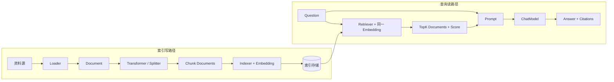

# Eino RAG L2 学习协议

## 当前状态

| 项目 | 值 |
|---|---|
| 学习工作区 | 仓库根目录 |
| 源码来源 | `module`：`github.com/cloudwego/eino@v0.9.12`；官方示例仓库作为阶段 2 辅助证据 |
| 框架版本 | Eino `v0.9.12`，commit `13e1a25c7238293a1e558391a65525a464acb324` |
| 目标等级 | L2：运行与诊断 |
| 当前阶段 | 阶段 4：运行闭环已完成；下一步阶段 5 |
| 当前决策门 | 无 |
| 最近更新 | 2026-07-22 |

## 输入解析

| 字段 | 解析结果 | 说明 |
|---|---|---|
| `workspace` | 当前仓库 | 沿用已完成的 Eino 与 Compose 学习工作区 |
| `source` | `module` | 读取根 `go.mod` 锁定的实际依赖，不切换远程 `main` |
| `module` | `github.com/cloudwego/eino@v0.9.12` | 与现有示例保持同一版本 |
| `target_level` | L2 | 能运行并区分索引、检索和生成故障，不以开发知识库平台为目标 |
| `mode` | `execute` | 用户说“继续”，但仍按决策门逐阶段推进 |
| `output` | `docs/learning/eino/rag/` | 与已完成的 Eino L2 和 Compose L3 产物分离 |

## 目标变更影响

- `建议` 保留 [Eino L2](../learning-protocol.md) 和 [Compose L3](../compose/learning-protocol.md) 的完成状态，RAG 作为新的组件集成子主题。
- `已验证` 根模块继续使用 Eino `v0.9.12` 和 Go `1.26.0` directive，本阶段不升级依赖。
- `建议` 复用已掌握的 Compose Workflow、ChatModel 节点、Callback 和错误链，但 RAG 的索引写路径、查询读路径、元数据与召回质量必须单独验证。
- `建议` 第一条主路径只处理本地 Markdown 和单次问答，不开发文件上传、数据库管理界面、多租户或成熟知识库产品。

## 学习目标

- 目标能力：能解释 RAG 为什么分为索引写路径和查询读路径，以及模型如何使用未训练进参数的新资料。
- 目标能力：能使用 Eino `Document`、`Embedding`、`Indexer`、`Retriever` 与 Compose 构建最小闭环。
- 目标能力：能依据召回文档、分数和最终 Prompt，区分解析、切分、向量化、检索和生成故障。
- 完成定义：版本匹配的官方示例完成构建与前置条件验证；自定义等价基线覆盖正常路径、超时、业务错误和依赖不可用；完成运行/源码链路与一次单变量迁移。官方示例的真实端到端运行仍单独标记，不因等价基线通过而伪装完成。
- 不在范围：知识库管理 UI、OCR、复杂 PDF、权限、多租户、增量同步、混合检索、Reranker、生产部署和容量评估。

## 版本基线

| 对象 | 版本/位置 | 依据 | 状态 |
|---|---|---|---|
| Eino 模块 | `github.com/cloudwego/eino v0.9.12` | 根 `go.mod`、本机模块缓存 | 已验证 |
| Eino 源码 | 本机 Go 模块缓存；tag commit `13e1a25c...` | 已完成的 Eino 版本基线 | 已验证 |
| 当前 Go | `go1.26.3 darwin/arm64` | 现有学习协议的实测记录 | 已验证 |
| 根模块 Go directive | `go 1.26.0` | 根 `go.mod` | 已验证 |
| EinoExt File Loader / Markdown Splitter | `v0.0.0-20250225083118-fd27d80f189c` | 官方同版本示例 `go.mod`、根 `go.mod`、实际构建与运行 | 已验证 |
| 官方示例候选 | `cloudwego/eino-examples/quickstart/eino_assistant`，commit `171220631fb7068ead50b7cd964b8c471647117d` | 子模块精确依赖 Eino `v0.9.12`；写路径、Retriever、构建和启动前置条件已核对 | 已验证版本匹配；运行受 Redis 认证与 Ark 配置阻塞 |
| 官方文档 | Eino `v0.9.12` tag README 与同版本包文档 | 本地模块源码 | 已验证版本匹配 |

## 框架定位卡

- 官方定位：`官方说明` Eino 定义可复用的 `Retriever`、`Embedding` 等组件抽象，并可通过 Compose 连接成独立运行的 Graph 或 Workflow。
- 框架类别：AI 组件与编排框架中的 RAG 组件子系统。
- 目标用户：需要用 Go 组合可替换的文档处理、向量化、索引、检索和生成能力的应用开发者。
- 核心问题：统一 RAG 各阶段的输入输出契约、调用选项、元数据传递、组件替换与 Compose 集成。
- 适用场景：资料需要动态更新、回答必须基于外部证据、且应用需要控制检索和生成链路。
- 不适用场景：资料很少且可直接放入上下文、只需要成熟知识库成品，或无需引用和检索诊断的一次性问答。
- 不使用 Eino 的替代成本：应用需自行定义文档、Embedding、索引和检索接口，并手工处理组件替换、Graph 适配、回调和错误路径。

## 主流设计

详细说明见 [architecture.md](architecture.md)。



### 核心机制

| 机制 | 为什么定义 RAG 主路径 | 主路径位置 | 删除后的退化形态 |
|---|---|---|---|
| `schema.Document` 与元数据 | 在加载、切分、索引、检索和引用之间传递正文及来源 | 写路径到读路径 | 只剩无法定位来源的字符串 |
| `embedding.Embedder` | 把索引文本和查询映射到同一向量空间 | Indexer 与 Retriever | 不能进行语义相似度检索 |
| `indexer.Indexer` | 把文档及向量写入可检索后端 | 离线或后台写路径 | 每次查询都重新处理全部资料 |
| `retriever.Retriever` | 按问题返回排序后的相关 `Document` | 在线读路径 | ChatModel 只能依赖参数知识或完整上下文 |
| Prompt 与 ChatModel | 将问题和召回证据组织为有依据的回答 | 召回之后 | 只有搜索结果，没有自然语言回答 |
| Compose 组件节点 | 把 Retriever、Prompt 和 ChatModel 放入可观察的确定性流程 | 在线问答路径 | 应用手写串联与错误上下文 |

### 责任边界

| 层级 | 负责 | 不负责 |
|---|---|---|
| Eino 核心 | `Document`、组件接口、通用选项、Flow 和 Compose 集成 | 具体模型、向量数据库、文件格式解析质量 |
| EinoExt | Loader、Parser、Splitter、Embedding、Indexer、Retriever 等具体适配器 | 应用资料规则、权限和答案正确性 |
| 应用 | 资料范围、元数据、Chunk 策略、TopK、阈值、Prompt、引用和错误语义 | 复制 Eino 内部调度器或依赖 `internal` 包 |
| 外部基础设施 | Embedding/ChatModel 服务、向量或搜索存储 | 决定应用检索策略和引用规则 |

## 主路径证据

详细证据见 [evidence.md](evidence.md)。

| 结论 | 独立证据 | 置信度 | 状态 |
|---|---|---|---|
| `Document` 是 Loader、Transformer、Indexer、Retriever 的共享数据结构 | `schema/document.go`、`components/document` 包文档 | 高 | 已验证源码 |
| Indexer 是写路径，Retriever 是读路径 | 两个组件包文档和公开接口 | 高 | 已验证源码 |
| 索引和查询必须使用相同 Embedding 模型 | Embedding、Indexer、Retriever 包文档 | 高 | 已验证源码 |
| Retriever 通过 `TopK` 和 `ScoreThreshold` 控制结果集合 | `components/retriever/option.go` | 高 | 已验证源码 |
| Retriever 可以作为 Compose 节点并接收调用级选项 | `compose/component_to_graph_node.go`、`graph_call_options.go` | 高 | 已验证源码 |
| Parent、MultiQuery、Router 属于基础闭环后的高级 Flow | `flow/indexer/parent`、`flow/retriever/*` | 高 | 已验证源码，不进入第一项目 |

## 决策门 1：版本与主路径

- 推荐版本：继续使用 Eino `v0.9.12` 与 Go `1.26.3`，本阶段不升级依赖。
- 推荐主路径：先分别验证索引写路径和查询读路径，再把在线路径组合为 `Retriever -> Prompt -> ChatModel`；不把索引动作放进每次问答。
- 官方基线候选：`eino-examples/quickstart/eino_assistant`。锁定 commit 的写路径为 `FileLoader -> MarkdownSplitter -> RedisIndexer`，查询侧使用 Redis Retriever 和同一个 Ark Embedding。
- 纵向项目候选：本地 Markdown 资料问答。它只是学习载体，不开发知识库管理产品。
- 推荐学习等级：L2。除了跑通正常路径，还要能通过召回结果、分数、Callback 和错误链定位故障。
- 主要争议：官方完整示例依赖 Redis、Ark ChatModel 和 Ark Embedding，能够证明真实集成但不是轻量离线基线。推荐阶段 2 原样构建并在具备凭据时运行；缺少凭据则明确记录运行阻塞，不把阅读源码写成运行成功。
- 明确排除：Parent Retriever、MultiQuery、Router、混合检索和 Reranker 不属于第一条主路径。
- 用户决定：确认采用 Eino `v0.9.12`、RAG L2、索引/查询双路径和 `quickstart/eino_assistant` 官方基线。
- 确认日期：2026-07-22。

## 官方完整示例

- 示例候选：`cloudwego/eino-examples/quickstart/eino_assistant`，commit `171220631fb7068ead50b7cd964b8c471647117d`。
- 选择原因：`官方说明` 该示例同时包含知识索引 Graph 和 Agent Retriever，能观察写路径与读路径，不是只有一次裸 Retriever 调用。
- 版本匹配：子模块 `go.mod` 精确依赖 Eino `v0.9.12`，声明 Go `1.23.0` 和 toolchain `go1.24.1`。
- 已核对写路径：`FileLoader -> MarkdownSplitter -> RedisIndexer`，编译为 `KnowledgeIndexing` Graph。
- 已核对读路径：Redis Retriever 使用 Ark Embedder，默认 `TopK=8`，把 Redis distance 转换为 `Document.Score()`。
- 前置条件：Redis/Redis Stack、`ARK_API_KEY`、`ARK_CHAT_MODEL`、`ARK_EMBEDDING_MODEL`；完整 Agent 还包含额外工具和可观测依赖。
- 实际构建命令：

```bash
GOCACHE=/private/tmp/eino-rag-official-gocache \
GOMODCACHE=/private/tmp/eino-rag-official-gomodcache \
go build ./...
```

- 构建结果：`已验证` 在 Go `1.26.3` 下退出码为 0，依赖写入系统临时缓存，未修改学习仓库。
- 实际运行命令：

```bash
GOCACHE=/private/tmp/eino-rag-official-gocache \
GOMODCACHE=/private/tmp/eino-rag-official-gomodcache \
go run cmd/knowledgeindexing/main.go
```

- 首次运行结果：`已验证` 沙箱外首先在 `knowledgeindexing` 包的 `init()` 中连接 `127.0.0.1:6379`，当时 Redis 未启动，返回 `connection refused` 并退出。
- Redis 启动后结果：`已验证` `127.0.0.1:6379` TCP 连接成功；再次原样运行返回 `NOAUTH Authentication required`。官方 `pkg/redis.Init()` 固定使用 `localhost:6379`，客户端选项没有用户名或密码字段，因此不能原样接入当前要求认证的 Redis。
- 认证适配实验：`已验证` 仅在 `/private/tmp` 的官方源码副本中增加 `.env` 文件路径和 Redis 用户名/密码读取，重新构建成功；使用仓库根 `.env` 后不再返回 `NOAUTH`，随后在 `FT.INFO` 返回 `ERR unknown command`。这证明认证配置有效，但当前服务没有官方示例依赖的 RediSearch/Vector 命令。
- Ark 配置状态：`已验证` `ARK_API_KEY`、`ARK_CHAT_MODEL`、`ARK_EMBEDDING_MODEL` 仍均未设置，只检查是否设置，未读取或输出变量值。
- 处理决定：原样运行结果与临时认证适配实验分开记录，不把适配结果冒充官方默认行为。当前不替换用户的 Redis；即使换成 Redis Stack，缺少 Ark API Key 与 Embedding 模型仍不能完成真实索引。
- 当前状态：版本、构建、Redis 连接、认证和模块能力均已验证；真实索引与查询未完成，剩余阻塞明确保留。

## 最小完整纵向项目

- 原生场景：本地 Markdown 资料的可诊断问答。
- 业务目标：启动时完成一次索引；提问时输出召回 Chunk、分数和来源，再基于证据生成带引用回答；无证据时不调用 ChatModel。
- 代码目录：`examples/rag-minimal/`。
- 默认运行：完全离线，不需要数据库、模型凭据或网络。

### 正常路径

```text
索引 Graph（每次进程启动一次）
Markdown Source
-> EinoExt FileLoader
-> EinoExt MarkdownSplitter
-> 本地 HashingEmbedder
-> MemoryVectorStore.Indexer

查询 Graph（每个问题一次）
Question
-> Retriever
-> 保存 Question 与召回 Documents 到 Local State
-> Branch
   -> 无证据：固定回答 -> END
   -> 有证据：Prompt -> ChatModel -> Answer + Sources -> END
```

### 框架身份机制与使用位置

| Eino 机制 | 使用位置 | 验证重点 |
|---|---|---|
| `schema.Document` 与元数据 | Loader 到引用结果 | `source`、`heading`、`chunk_id` 不丢失 |
| `document.Loader` / `Transformer` | 索引 Graph | 真实使用 EinoExt 文件加载与 Markdown 切分组件 |
| `embedding.Embedder` | Indexer 与 Retriever | 同一个实例、相同维度；离线实现可解释和可重复 |
| `indexer.Indexer` / `retriever.Retriever` | 内存向量 Store | Store 写入、余弦排序、TopK 和阈值 |
| Compose 组件节点 | 两条 Graph | 不把 Eino 组件藏在普通 Lambda 内 |
| Branch 与 Local State | 查询 Graph | 无证据跳过 ChatModel；保留问题和真实召回文档 |
| Callback 与节点错误路径 | 两条 Graph | 区分 Loader、Embedding、Indexer、Retriever 和 ChatModel 故障 |

### 外部边界与替代实现

| 边界 | 默认实现 | 在线/后续替代 | 本阶段取舍 |
|---|---|---|---|
| Loader | EinoExt File Loader | URL、S3、PDF Loader | 只读取仓库内 Markdown |
| Splitter | EinoExt Markdown Splitter | Recursive/Semantic Splitter | 先保留标题元数据，不比较多种算法 |
| Embedding | 本地字符 n-gram Hashing Embedder | Ark/OpenAI/Ollama Embedder | 默认离线；明确不代表生产语义质量 |
| Store | 进程内 MemoryVectorStore | Redis Indexer/Retriever | 先观察向量与分数，不引入数据库生命周期 |
| ChatModel | 确定性 Extractive ChatModel | 已有 OpenAI 兼容 ChatModel | 默认测试稳定；在线生成只做显式冒烟 |

### 故障与可观测性

| 场景 | 注入位置 | 预期行为 | 证据 |
|---|---|---|---|
| 业务错误 | 空白问题进入查询 Graph | 返回稳定 sentinel error，不执行 Retriever | 测试与调用计数 |
| 超时 | blocking Embedder 等待 `ctx.Done()` | `context.DeadlineExceeded` 保留错误链和节点路径 | 测试、Callback |
| 依赖不可用 | Indexer 或 Retriever 返回 sentinel error | 快速失败，不生成伪答案 | 测试、`errors.Is` |
| 无证据 | Retriever 返回空结果 | Branch 返回固定无依据回答，ChatModel 调用次数为 0 | 测试与调用计数 |
| 向量契约错误 | Embedder 返回数量或维度不一致 | Indexer/Retriever 明确报错，不静默排序 | 单元测试 |

运行输出至少展示：索引文档数、Chunk 数、召回排名、`Document.Score()`、来源、标题、Chunk ID、最终回答和引用。Callback 只记录组件与节点元数据，不记录完整资料或 Prompt。

### 测试层级

| 层级 | 用例 | 外部访问 | 核心断言 |
|---|---|---|---|
| Embedder/Store 单元测试 | 向量数量、维度、余弦排序、TopK、阈值 | 无 | 数学和选项契约 |
| 索引 Graph 测试 | Markdown 加载、切分、元数据、写入 | 无 | Chunk 可定位，索引 ID 稳定 |
| 查询 Graph 测试 | 正常召回、无证据、引用 | 无 | 召回与生成分离，引用来自真实 Document |
| 故障测试 | 空问题、超时、依赖不可用、向量不一致 | 无 | 错误链、节点路径、无伪成功 |
| 竞态测试 | 同一 Runnable 并发提问 | 无 | Local State 和内存 Store 无数据竞争 |
| 在线冒烟 | OpenAI 兼容 ChatModel | 模型服务 | 只替换生成组件；不纳入默认回归 |

### 保留与省略

| 能力 | 决定 | 理由 |
|---|---|---|
| 索引/查询双路径 | 保留 | RAG 的核心生命周期边界 |
| Document 元数据、分数和引用 | 保留 | 诊断和可信回答必需 |
| 无证据 Branch | 保留 | 防止模型无依据生成和无效调用 |
| 默认离线测试 | 保留 | 保证可重复且不需要凭据 |
| 数据库和持久化 | 省略 | 第一阶段只验证原理；Memory Store 是明确替换边界 |
| Parent/MultiQuery/Router/Reranker | 省略 | 会同时引入父子关系、改写和融合策略，掩盖基础召回问题 |
| UI、上传、权限、OCR | 省略 | 属于知识库产品，不定义本轮 RAG L2 |

### 实际验证命令与结果

```bash
gofmt -w examples/rag-minimal/*.go
go test ./examples/rag-minimal -count=1
go test -race ./examples/rag-minimal -count=1
go test ./... -count=1
go vet ./...
go run ./examples/rag-minimal "RAG 的索引写路径和查询读路径为什么要分开？"
```

- `已验证` `go test -v ./examples/rag-minimal -count=1`：正常路径、稳定 Chunk ID、空问题、无证据、Indexer/Retriever 不可用、Embedding 超时、TopK/阈值、向量契约和并发查询全部通过。
- `已验证` `go test -race ./examples/rag-minimal -count=1`：通过，无数据竞争报告。
- `已验证` `go test ./... -count=1`：三个示例包全部通过。
- `已验证` `go vet ./...`：通过，无输出。
- `已验证` `go run ./examples/rag-minimal`：索引 1 个 Markdown 为 5 个 Chunk；查询召回 3 个 Chunk，首条为“RAG 主路径”，分数 `0.4777`，ChatModel 调用 1 次并生成带真实召回记录的回答。

## 决策门 2：纵向项目范围

- 推荐范围：批准上述本地 Markdown、Hashing Embedder、MemoryVectorStore、无证据 Branch 和确定性 ChatModel 的离线闭环。
- 推荐新增依赖：只增加官方示例已验证兼容的 EinoExt File Loader 与 Markdown Splitter；不增加 Redis、Ark Embedding 或其他数据库依赖。
- 取舍依据：真实使用 Eino 的文档组件、索引/检索接口和 Compose 节点，同时把语义模型、数据库和网络移出默认故障面；每个替代实现的限制都会在输出和 README 明示。
- 单变量迁移候选：后续只把 MemoryVectorStore 替换为 Redis Indexer/Retriever，继续使用同一个离线 Embedder，以验证存储边界而不同时更换模型。
- 用户决定：确认采用推荐的离线最小闭环；Redis 保留到单变量迁移阶段。
- 确认日期：2026-07-22。

## 执行阶段

| 阶段 | 状态 | 产物 | 验证 |
|---|---|---|---|
| 0. 版本基线 | 已完成 | 本协议、`evidence.md` | 根 `go.mod`、本地模块源码 |
| 1. 第一版全景图 | 已完成 | `architecture.md`、`evidence.md` | 决策门 1 已于 2026-07-22 通过 |
| 2. 官方完整示例 | 已完成受限验证 | 本协议、`evidence.md` | 原样构建成功；认证适配后确认当前 Redis 缺少 RediSearch，且 Ark 配置缺失 |
| 3. 纵向项目设计 | 已完成 | 本协议 | 决策门 2 已于 2026-07-22 通过 |
| 4. 运行闭环 | 已完成 | `examples/rag-minimal/`、`failure-matrix.md` | 正常路径、异常测试、竞态测试、仓库测试、`vet` 和 CLI 实际输出 |
| 5. 源码链路 | 待开始 | 运行链路、源码导航 | 文件与符号引用 |
| 6. 单变量迁移 | 待开始 | 迁移预测和结果 | 回归测试 |
| 7. L2 验收 | 待开始 | 验收记录 | 决策门 3 |

## 问题债务

| 问题 | 当前假设 | 影响范围 | 验证方式 | 最晚解决阶段 |
|---|---|---|---|---|
| 官方完整示例是否能在当前环境原样运行 | 已确认不能：官方初始化未配置认证；适配认证后又确认当前 Redis 缺少 RediSearch；Ark 三项配置也未设置 | 官方基线运行证据 | 分开保留原样运行与临时适配实验记录；不伪装完成 | L2 验收 |
| Hashing Embedder 的召回能否代表真实语义质量 | 不能；它只验证接口、排序与错误边界 | 生产选型与召回质量 | 阶段 6 单变量迁移后仍需独立评测真实 Embedding | L2 验收 |
| 当前普通 Redis 是否能作为迁移目标 | 不能；缺少 `FT.INFO` 等 RediSearch 命令 | 阶段 6 Store 迁移 | 使用独立 Redis Stack 实例，避免影响现有 Redis | 阶段 6 |

## 产物索引

- [证据表](evidence.md)
- [架构图与责任边界](architecture.md)
- [故障矩阵](failure-matrix.md)

## 下一步

进入阶段 5，从 CLI 的一次真实查询追踪 `App.Ask -> Graph -> Retriever -> Branch -> ChatModel -> QueryResult`，生成运行链路与源码导航。
