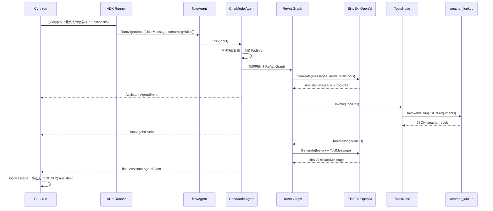

# Eino 天气 Agent 运行链路

## 追踪基线

- `已验证` Eino 源码：`v0.9.12`，commit `13e1a25c7238293a1e558391a65525a464acb324`。
- `已验证` 模型组件：EinoExt OpenAI `v0.1.13`，底层 ACL OpenAI `v0.1.17`。
- `已验证` 应用模式：`RunnerConfig.EnableStreaming=false`。
- 真实输入：`北京天气怎么样？`。
- 实际结果：第一次模型调用产生 `weather_lookup` ToolCall，Tool 返回北京晴天、28°C、湿度 35%，第二次模型调用生成一致的最终回答。

本文件只追踪上述非流式请求。多 Agent、checkpoint、retry、failover 和流式读取不属于本阶段链路。

## 端到端序列



## 正常路径

| 步骤 | 文件与符号 | 跨层数据 | 已验证结论 |
|---|---|---|---|
| 1. 建立调用边界 | `main.go:run` | CLI 参数、环境配置、带 deadline 的 `context.Context` | 同一个 ctx 传入模型构造、Agent 和 Provider |
| 2. 装配 Agent | `agent.go:NewWeatherAgent` | `ToolCallingChatModel`、`WeatherProvider`、`InvokableTool` | 应用固定单 Agent、单 Tool、非流式 Runner |
| 3. 创建 Tool schema | `weather.go:NewWeatherTool` -> `utils.InferTool` | `WeatherRequest` 的 JSON/jsonschema tag -> `schema.ToolInfo` | Tool metadata 与 Tool 执行由同一公开对象提供 |
| 4. 创建用户消息 | `Runner.Query` -> `newUserMessage` | string -> `schema.UserMessage` | `Query` 是 `Run` 的便利入口，不含 Agent 业务逻辑 |
| 5. 进入统一生命周期 | `typedRunnerRunImpl` -> `toFlowAgent` -> `flowAgent.Run` | `AgentInput{Messages, EnableStreaming:false}` | 即使只有一个 Agent，也经过 flowAgent，统一注入命名、回调、run path 和取消 |
| 6. 首次冻结配置 | `ChatModelAgent.buildRunFunc` -> `prepareExecContext` -> `genToolInfos` | `BaseTool.Info()` -> `[]*schema.ToolInfo` | 配置通过 `sync.Once` 冻结；有 Tool 时选择 ReAct 路径 |
| 7. 创建执行图 | `buildMessageReActRunFunc` -> `newReact` -> `Chain.Compile` | instruction + user messages -> `reactInput` | run closure 被复用，但 ReAct Graph 在每次执行中创建并编译 |
| 8. 第一次模型调用 | `ChatModelAgent.Run` -> `model.WithTools` -> OpenAI `Generate` | system/user messages + ToolInfo -> Chat Completions request | Tool schema 是调用级 option，不要求修改共享模型实例 |
| 9. 发出模型事件 | `typedEventSenderModel.Generate` | Assistant message + ToolCall -> `AgentEvent` | event-sender wrapper 在模型成功后主动写入 Agent generator |
| 10. ReAct 分支 | `newReact.toolCallCheck` | 模型消息流中的 `ToolCalls` | 有 ToolCall 走 `CancelCheck -> ToolNode`；无 ToolCall 走终点 |
| 11. Tool 调度 | `ToolsNode.Invoke` -> `runToolCallTaskByInvoke` | Tool name、arguments、call ID | ToolsNode 按名称定位 endpoint；单 Tool 也使用相同调度机制 |
| 12. 领域执行 | `invokableTool.InvokableRun` -> `WeatherProvider.Lookup` | JSON -> `WeatherRequest` -> `Weather` -> JSON | `InferTool` 负责 JSON 解码/编码，应用函数只处理类型化输入输出 |
| 13. Tool 结果回环 | Tool event sender + `schema.ToolMessage` + `afterToolCalls` | result + 原 ToolCallID | Tool event 发给入口；ToolMessage 追加到 ReAct state 后回到 ChatModel |
| 14. 第二次模型调用 | OpenAI `Generate` | system、user、assistant ToolCall、tool result | 模型根据受控 Tool 数据生成最终 Assistant message |
| 15. 返回应用 | `flowAgent.run` -> `AsyncIterator.Next` -> `adk.GetMessage` | 带 `AgentName`/`RunPath` 的事件 | 应用先检查 `event.Err`，只选择无 ToolCall 的 Assistant 作为最终回答 |

## ReAct 图的实际拓扑

```text
START
  -> Init
  -> ChatModel
       | 无 ToolCall -> END
       | 有 ToolCall
       v
     CancelCheck
       -> ToolNode
       -> AfterToolCalls
       -> AfterToolCallsCancelCheck
       -> ChatModel
```

`MaxIterations=4` 在 ChatModel 节点的 state pre-handler 中递减；超过上限返回 `ErrExceedMaxIterations`。本示例未配置 return-direct Tool，因此 Tool 结果总是回到 ChatModel，而不是直接结束。

## 错误与取消传播

### Tool 错误

```text
WeatherProvider error
-> weather_lookup 使用 %w 包装
-> InferTool InvokableRun 使用 %w 包装
-> ToolsNode 使用 %w 包装
-> Compose NodeRunError（Unwrap 返回原错误）
-> ChatModelAgent.handleRunFuncError
-> AgentEvent.Err
-> WeatherAgent.Query 使用 %w 包装
-> ErrorKind / errors.Is
```

因此 `context.DeadlineExceeded`、`ErrUnsupportedCity` 和 `ErrWeatherUnavailable` 在入口仍可用 `errors.Is` 判断。阶段 4 的三类故障测试已经逐项证明该链路。

### 模型错误

底层 ACL 在创建 request 或调用 Chat Completions 失败时使用 `%w` 返回；EinoExt 转换厂商错误后继续返回给 Compose。Compose 给错误增加节点路径，ChatModelAgent 再通过 `AgentEvent.Err` 交给入口。模型失败不会进入 Tool，也不会生成伪成功的最终回答。

### context 取消

CLI 创建的 ctx 依次传入 Runner、flowAgent、ChatModelAgent、Compose、EinoExt HTTP 调用、ToolsNode 和 Provider。当前 Provider 在入口先检查 `ctx.Err()`；故障测试中的 blocking Provider 等待 `ctx.Done()`。本阶段没有配置 ADK 的额外 cancel mode，因此 deadline 的主要语义来自标准 `context.Context`。

## Callback 旁路

`adk.WithCallbacks` 把 Observer 作为 per-run option 注入。`flowAgent` 首先为 Agent 设置 `RunInfo`；Compose 的 Graph、Chain、Lambda、ChatModel 和 Tool 节点继承同一组 handlers 并替换各自的 `RunInfo`。

- OpenAI ACL 在 `Generate` 内调用 `OnStart`、`OnEnd` 或 `OnError`。
- InferTool 本身不声明已处理 Callback，因此 ToolsNode 自动为它包装 Callback。
- Observer 不修改 callback input/output，只记录组件、名称、类型、状态、耗时和错误类别。
- Callback 是观测旁路，不负责把错误送回应用；业务正确性仍以 `AgentEvent.Err` 和 `errors.Is` 为准。

## 生命周期结论

| 时点 | 行为 |
|---|---|
| 应用启动 | 构造 OpenAI client、InferTool、ChatModelAgent 和 Runner；不发模型请求 |
| Agent 第一次运行 | `sync.Once` 读取 ToolInfo、选择 ReAct 并冻结默认 run closure |
| 每次 Query | 建立 run context、per-run callbacks、Agent iterator，并创建/编译本次 ReAct Graph |
| 每次 ChatModel 节点 | 通过调用级 `model.WithTools` 传递当前 ToolInfo |
| 每次 ToolCall | 按 call ID 创建 Tool event 和 ToolMessage，二者共享同一领域结果 |
| 执行结束 | generator 关闭；flowAgent 补充 AgentName/RunPath；应用把 iterator 消费到关闭 |

精确源码入口和推荐阅读顺序见 [source-map.md](source-map.md)。
