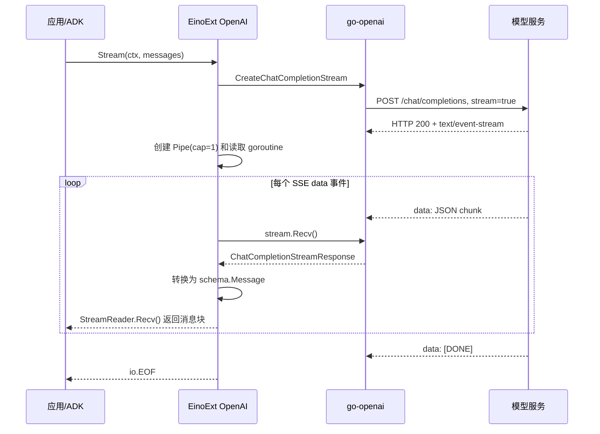

# Eino 流式处理学习笔记

## 记录范围

- 学习日期：2026-07-17。
- Eino：`v0.9.12`。
- EinoExt OpenAI：`v0.1.13`。
- EinoExt OpenAI ACL：`v0.1.17`。
- 底层 OpenAI 客户端：`github.com/meguminnnnnnn/go-openai v0.1.2`。
- 当前示例：`examples/diagnosable-weather-agent/`。

本文只总结非流式与流式的实现差异、运行链路和工程取舍，不新增端到端流式输出接口，也不把 RAG 纳入当前 L2 实现范围。

## 核心结论

`已验证` 模型流式响应不是客户端轮询。客户端只发送一次 HTTP 请求，模型服务在同一个响应连接上持续发送 SSE `data:` 事件；EinoExt 使用 goroutine 阻塞读取事件、转换消息并写入 `schema.Pipe`，下游通过 `StreamReader.Recv()` 逐块消费。

```text
一次 HTTP POST
-> 模型服务持续发送 SSE data 事件
-> EinoExt goroutine 阻塞读取并转换
-> schema.Pipe
-> StreamReader.Recv
-> ADK / 应用
```

这是一条“服务端推送 + 适配层 goroutine 读取 + 应用按需 Recv”的链路。没有数据时 goroutine 阻塞在网络读取或 channel 上，不会持续空转。

## 实现链路



### 已验证源码事实

| 结论 | 证据 |
|---|---|
| 底层客户端只发送一次 HTTP 请求，并声明接受 `text/event-stream` | [`go-openai` `sendRequestStream`](https://github.com/meguminnnnnnn/go-openai/blob/v0.1.2/client.go#L182) |
| 底层 `Recv` 阻塞读取 SSE 行，识别 `data:` 和 `[DONE]` | [`go-openai` `streamReader.Recv`](https://github.com/meguminnnnnnn/go-openai/blob/v0.1.2/stream_reader.go#L35) |
| OpenAI 兼容请求设置 `stream=true`，并建立流式 Chat Completions 响应 | [EinoExt ACL `Client.Stream`](https://github.com/cloudwego/eino-ext/blob/libs/acl/openai/v0.1.17/libs/acl/openai/chat_model.go#L835) |
| EinoExt 创建容量为 1 的 `schema.Pipe`，启动 goroutine 循环调用底层 `stream.Recv()` | [EinoExt ACL 流读取循环](https://github.com/cloudwego/eino-ext/blob/libs/acl/openai/v0.1.17/libs/acl/openai/chat_model.go#L858) |
| 每个有效响应块转换为 `schema.Message` 后通过 `StreamWriter.Send` 发送 | [EinoExt ACL 消息发送](https://github.com/cloudwego/eino-ext/blob/libs/acl/openai/v0.1.17/libs/acl/openai/chat_model.go#L902) |
| Eino `Pipe` 使用 channel 连接单个生产者和单个消费者 | [Eino `schema/stream.go`](https://github.com/cloudwego/eino/blob/v0.9.12/schema/stream.go#L76) |
| `StreamReader.Recv` 是阻塞式消费接口，流必须由消费者关闭 | [Eino `StreamReader`](https://github.com/cloudwego/eino/blob/v0.9.12/schema/stream.go#L143) |
| ADK 的模型包装器把模型流复制为事件流和 ReAct 内部流 | [Eino `typedEventSenderModel.Stream`](https://github.com/cloudwego/eino/blob/v0.9.12/adk/wrappers.go#L319) |

容量为 1 的 Pipe 提供背压：消费者慢时，生产 goroutine 最多领先一个 Eino 消息块，之后会阻塞在 `Send()`。TCP 和 HTTP 实现仍可能有自己的缓冲，因此这不是严格的逐 token 同步。

## 非流式与流式差异

| 对比项 | 非流式 | 流式 |
|---|---|---|
| Eino 模型接口 | `Generate` | `Stream` |
| Compose 执行 | `Invoke` | `Stream` |
| HTTP 响应 | 完整 JSON | SSE 长响应 |
| 返回时机 | 完整结果生成后 | 响应流建立后返回 `StreamReader` |
| 应用数据 | 一个完整 `schema.Message` | 多个 `schema.Message` 分块 |
| 应用消费 | 直接读取返回值 | 循环调用 `Recv()` |
| 错误位置 | 方法直接返回错误 | 建立流错误和流读取错误两条路径 |
| 资源管理 | 完整响应读取后结束 | 消费者必须关闭 `StreamReader` |
| 适合场景 | 完整校验、结构化处理、原子操作 | 渐进展示、实时事件、可增量处理 |

一次 `Recv()` 不等于一个 token。分块边界由模型服务决定，消息块可能包含一个或多个 token、部分 ToolCall 参数、usage、finish reason，或者没有文本内容。

## 当前天气 Agent 的边界

`已验证` 当前 Runner 设置 `EnableStreaming=true`，所以 OpenAI 到 Eino、Eino 到 ADK 事件都是流式的；但 `WeatherAgent.Query` 调用 `adk.GetMessage`，等待流结束并拼接完整消息后才返回 CLI。

```text
OpenAI -> EinoExt：流式
EinoExt -> ADK：流式
ADK -> WeatherAgent.Query：流式事件
WeatherAgent.Query -> CLI：完整消息
```

因此当前示例属于“内部流式、外部聚合”，不属于端到端流式。它验证的是流生命周期、错误传播和资源关闭，不提供逐块 CLI 展示。

### `adk.GetMessage` 的作用

`已验证` 流式事件进入 `adk.GetMessage` 后会复制消息流：一份被拼接为完整 `Message`，另一份保留在返回事件中。

```text
MessageStream
-> Copy(2)
   |- 消费副本：读取到 EOF，拼接完整 Message
   `- 保留副本：放回 AgentEvent
```

当前应用不再使用保留副本，因此在 `consumeAgentEventMessage` 中显式关闭它。否则只能依赖 GC 自动关闭兜底，资源释放时间不可控。

源码见 [Eino `TypedGetMessage`](https://github.com/cloudwego/eino/blob/v0.9.12/adk/utils.go#L278)。

## 流式错误模型

流式调用必须区分三种结果：

| 结果 | 出现位置 | 应用行为 |
|---|---|---|
| 建立流失败 | `model.Stream()` 直接返回 error | 返回请求失败；Callback `OnError` 可以观测 |
| 流中途失败 | 某次 `StreamReader.Recv()` 返回非 EOF error | 停止消费、关闭流、取消 Context、标记部分结果不完整 |
| 正常结束 | `StreamReader.Recv()` 返回 `io.EOF` | 关闭流并结束本次生成 |

`已验证` 模型已经成功返回 StreamReader 后发生的错误不会进入 ChatModel `OnError`，必须由流消费者检查 `Recv()` 或 `adk.GetMessage` 返回的错误。

端到端流式场景中，用户可能已经看到部分内容。若上游模型流失败而用户连接仍可写，服务端应发送稳定的中断事件并关闭当前流；详细内部错误只写日志。

```text
event: error
data: {"code":"MODEL_STREAM_INTERRUPTED","message":"回答生成中断，请重试"}
```

如果用户到服务端的连接本身已断开，则无法再发送错误事件，只能取消模型请求、关闭资源并记录日志。错误应结束当前请求，不应通过 `panic` 终止整个服务。

## SSE 与 WebSocket

当前 OpenAI 兼容模型流使用基于 HTTP 的 SSE 风格响应：客户端先发送一次请求，服务端在响应方向持续发送 `data:` 事件。

| 对比项 | SSE / HTTP 流 | WebSocket |
|---|---|---|
| 应用层方向 | 服务端到客户端 | 同一连接全双工 |
| 建立方式 | 普通 HTTP 请求和长响应 | HTTP Upgrade |
| 客户端后续输入 | 新的 HTTP 请求 | 同一连接继续发送 |
| 数据格式 | 文本事件 | 文本或二进制帧 |
| 典型用途 | 模型输出、通知、日志 | 实时协作、语音、游戏、双向控制 |

底层 TCP 仍是双向连接，但 SSE 的业务数据流主要位于 HTTP 响应方向。客户端可以关闭连接或取消 Context，却不能在同一个 SSE 响应体内发送下一轮用户消息。

## 选择流式还是非流式

`建议` 判断标准不是“流式是否更先进”，而是下游能否在结果完整前做有价值的工作。

适合流式：

- 用户需要尽早看到长回答。
- 下游可以逐块处理日志、字幕、搜索结果或文件。
- 允许部分结果可见，并能表达中途失败。
- 需要支持用户提前取消。

适合非流式：

- 必须得到完整 JSON 后统一解析和校验。
- 下一步依赖全部上下文。
- 需要整体排序、聚合或事实检查。
- 要执行数据库写入、支付、审批等原子操作。
- 部分结果不能安全暴露。

如果上游使用流式、下游必须得到完整结果，可以在边界处聚合；此时不会获得端到端首包延迟收益，但仍需承担流读取、错误和关闭管理。

## RAG 的推荐模式

`建议` 标准 RAG 适合混合模式，而不是全链路流式：

```text
Query 改写：非流式
-> Embedding：非流式
-> Retrieve：非流式
-> Rerank：非流式
-> 固定上下文：非流式
-> 最终回答：按消费方需求选择流式或非流式
```

面向用户的知识库问答通常只把最终自然语言生成设为流式。检索和重排先完成，可以避免回答过程中改变依据。若最终结果还要执行结构化解析、整体校验或业务操作，则最终生成也应聚合后再进入下一步。

## 最短记忆

```text
非流式：等待全部完成，再返回一次。
流式：先返回读取器，再持续 Recv 分块。

模型服务负责推送 SSE。
EinoExt goroutine 负责读取和转换。
StreamReader 负责向下游交付。
应用负责 Recv、错误判断、取消和关闭。

Stream() error：流建立失败。
Recv() error：流运行中失败。
io.EOF：流正常结束。
```
