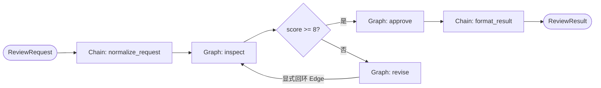

# 14. 在 Chain 中嵌入 Graph

前置示例见 [13. 使用 Chain 编写流水式 Graph](../13-chain-pipeline-template/README.md)。

## 结论

当顶层业务主要是固定顺序、某个局部流程需要回环或任意连边时，推荐使用“外层 `compose.Chain` + 内层 `compose.Graph`”：

- `Chain` 保留顶层流程的阅读顺序，并自动连接普通步骤。
- `Graph` 只封装非线性局部拓扑，例如本示例的“检查失败 -> 修订 -> 重新检查”。
- `AppendGraph` 用明确的输入输出类型连接两者，不需要把整个业务都改写成手工 Edge。

这不是两套运行引擎拼接。`Chain` 内部也会构建 Graph，`AppendGraph` 只是把另一个 Graph 作为一个有类型边界的组合节点加入外层流程。

## 学习目标

1. 使用 `Chain.AppendGraph` 嵌入一个子 Graph。
2. 区分外层线性编排与内层非线性拓扑的职责。
3. 使用 `WithGraphCompileOptions` 单独配置子 Graph 的名称和最大运行步数。
4. 验证子 Graph 回环结束后，结果会继续流向外层 Chain 的下一个节点。

涉及的 Eino 组件：`compose.Chain`、`compose.Graph`、`AppendGraph`、`AddEdge`、`AddBranch`、`WithGraphCompileOptions` 和 `WithMaxRunSteps`。

## 流程结构



外层 Chain 只有三个阶段：

```go
pipeline.
    AppendLambda(compose.InvokableLambda(normalizeRequest)).
    AppendGraph(decisionGraph).
    AppendLambda(compose.InvokableLambda(formatResult))
```

内层 Graph 显式声明回环：

```go
graph.AddEdge(compose.START, nodeInspect)
graph.AddBranch(nodeInspect, branch)
graph.AddEdge(nodeRevise, nodeInspect)
graph.AddEdge(nodeApprove, compose.END)
```

`reviewDraft` 是子 Graph 输入，`reviewDecision` 是子 Graph 输出。Eino 在编译时检查这两个类型是否能分别承接前一个 Chain 节点和后一个 Chain 节点。

## 为什么这样组合

如果全部使用 Chain，固定顺序很清晰，但 `revise -> inspect` 回环无法通过继续 `Append...` 自然表达。如果全部使用 Graph，则顶层三个固定阶段也要手工注册节点并维护 Edge。

组合后的职责是：

| 层级 | API | 负责内容 |
|---|---|---|
| 外层 | `Chain` | 规范化、调用决策模块、格式化结果 |
| 内层 | `Graph` | 检查、条件选择、修订和回环 |
| 边界 | `AppendGraph` | `reviewDraft -> reviewDecision` 的类型化连接 |

推荐依据是拓扑形态，而不是统一使用某一种 API：线性区域使用 Chain，真正需要任意连边、汇聚或循环的局部区域才下沉为 Graph。

## 循环保护

子 Graph 通过节点 Option 单独配置：

```go
compose.WithGraphCompileOptions(
    compose.WithGraphName("review_decision_graph"),
    compose.WithMaxRunSteps(8),
)
```

即使以后修改业务逻辑导致退出条件失效，子 Graph 也会在超过最大步数后返回错误，而不是无限运行。示例中的 `revise` 会补充退款到账说明，因此第二次 `inspect` 可以通过。

## 运行与验证

仓库声明 Go `1.26.0`，Eino 锁定为 `v0.9.12`。示例不访问网络，也不需要凭据。

在仓库根目录执行：

```bash
go run ./examples/go-study/framework-api-design/14-chain-with-graph
go test ./examples/go-study/framework-api-design/14-chain-with-graph -count=1
```

预期输出：

```text
approved=true score=9 attempts=1 steps=[normalize_request inspect approve format_result] content="退款将在 3 个工作日到账。"
approved=true score=9 attempts=2 steps=[normalize_request inspect revise inspect approve format_result] content="请尽快处理。 补充：退款将在 3 个工作日到账。"
```

测试覆盖直接通过、修订后回环、空内容、nil context 和运行取消。已知限制：修订逻辑是为了观察拓扑而设计的确定性本地实现，不代表真实内容审核模型。
