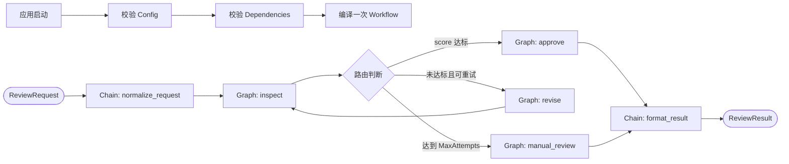

# 14. 生产型 Chain 与 Graph 组合

前置示例见 [13. 使用 Chain 编写流水式 Graph](../13-chain-pipeline-template/README.md)。

## 结论

代码定义工作流时，推荐使用“应用门面 + 外层 Chain + 内层 Graph”：

- 应用只调用 `reviewworkflow.New` 和 `Workflow.Run`，不直接依赖 Eino `Runnable`。
- 外层 `Chain` 表达稳定的线性阶段，并自动连接普通节点。
- 内层 `Graph` 封装 Branch、回环和局部退出路径。
- 配置和外部依赖在启动阶段校验并注入，工作流只编译一次，请求阶段重复使用。

这种结构保留 Eino 的类型检查和拓扑能力，同时让应用层、业务实现和编排框架保持清晰边界。不要再为 Eino 包装一套通用节点 DSL。

## 学习目标

1. 使用 `Workflow` 门面隔离 Eino API。
2. 使用 `Config` 管理路由阈值、业务尝试次数和 Graph 技术步数上限。
3. 使用 `Dependencies` 注入审核与修订能力。
4. 使用 `Chain.AppendGraph` 组合线性主流程和循环子图。
5. 区分业务退出上限 `MaxAttempts` 与技术保护 `MaxGraphSteps`。

涉及的 Eino 组件：`compose.Chain`、`compose.Graph`、`AppendGraph`、`AddEdge`、`AddBranch`、`WithGraphCompileOptions` 和 `WithMaxRunSteps`。

## 目录职责

```text
14-chain-with-graph/
├── main.go                        应用装配和调用入口
├── README.md                      运行说明和扩展规则
└── reviewworkflow/
    ├── workflow.go                稳定的 New/Run 门面
    ├── config.go                  工作流配置和约束校验
    ├── dependencies.go            Inspector/Reviser 依赖接口
    ├── build.go                   外层 Chain 拓扑
    ├── decision_graph.go          内层 Graph 拓扑
    ├── handlers.go                节点和路由业务实现
    ├── types.go                   公开契约和内部流转类型
    ├── errors.go                  稳定错误分类
    ├── local_components.go        无外部服务的示例依赖
    └── workflow_test.go           路径、错误、配置和并发测试
```

`reviewworkflow` 是可导入的业务包，不使用 `package main`。应用入口只负责创建依赖、构建一次工作流并调用 `Run`。

## 运行结构



外层拓扑集中在 `build.go`：

```text
normalize_request -> decision_graph -> format_result
```

内层拓扑集中在 `decision_graph.go`：

```text
START -> inspect
inspect -> approve -> END
inspect -> revise -> inspect
inspect -> manual_review -> END
```

`reviewDraft` 是子 Graph 输入，`reviewDecision` 是子 Graph 输出。它们是包内类型，不会泄漏到应用 API。

## 生产边界

### Workflow 门面

`Workflow` 在包内保存 `compose.Runnable[ReviewRequest, ReviewResult]`。调用方不能绕过统一入口传入任意 Eino Option，也不需要了解 Graph 的内部类型。

推荐生命周期：

```text
进程启动：加载配置 -> 创建依赖 -> reviewworkflow.New
请求处理：复用 Workflow -> Workflow.Run
进程退出：由依赖所有者关闭数据库、模型客户端等资源
```

不要在每个请求中重新调用 `New` 或 `Compile`。注入的依赖如果包含可变状态，必须自行保证并发安全。

### Config

| 字段 | 作用 |
|---|---|
| `ApprovalScore` | 审核通过阈值，范围为 `[1, 10]` |
| `MaxAttempts` | 业务允许的最大检查次数，达到后转人工 |
| `MaxGraphSteps` | Eino Graph 的技术步数保护，防止意外死循环 |

构建阶段会检查 `MaxGraphSteps >= 2 * MaxAttempts`，保证最长正常业务路径不会先被技术保护截断。

### Dependencies

`Inspector` 和 `Reviser` 是业务需要的能力接口。示例提供本地确定性实现；生产应用可以注入模型、规则引擎或远程服务适配器。

节点会保留依赖错误链，并校验依赖返回的分数和修订内容。超时、重试、熔断和限流应根据依赖性质在适配器层实现，不应混入 Graph 路由。

## 如何扩展

### 增加普通节点

1. 在 `handlers.go` 增加类型明确的 Handler。
2. 在 `build.go` 的目标位置增加一个 `AppendLambda`。
3. 为成功、错误和 context 取消补充测试。

不要修改公共 `Workflow.Run`，也不要创建通用 `[]NodeConfig`。

### 增加子 Graph

1. 新建 `buildXXXGraph`，明确 Graph 的输入和输出类型。
2. 在子 Graph 内维护节点、Edge、Branch、业务退出条件和最大步数。
3. 在外层 `buildPipeline` 中增加一个 `AppendGraph`。
4. 测试所有退出路径，以及子 Graph 前后节点的类型边界。

### 增加外部能力

1. 在 `dependencies.go` 定义最小业务接口。
2. 在应用装配层创建具体实现并注入 `Dependencies`。
3. Handler 只依赖接口，不直接读取全局变量或创建客户端。

## 数据传递约定

影响 Branch 或最终结果的数据通过参数显式传递：

```text
ReviewRequest -> reviewDraft -> reviewDecision -> ReviewResult
```

请求 ID、审计事件和节点耗时等旁路数据以后可以加入 Eino Local State。影响路由、幂等或业务结果的数据不要隐藏到 Local State。

## 运行与验证

仓库声明 Go `1.26.0`，Eino 锁定为 `v0.9.12`。示例不访问网络，也不需要凭据。

在仓库根目录执行：

```bash
go run ./examples/go-study/framework-api-design/14-chain-with-graph
go test ./examples/go-study/framework-api-design/14-chain-with-graph/... -count=1
go test -race ./examples/go-study/framework-api-design/14-chain-with-graph/... -count=1
```

预期输出：

```text
approved=true route=approved score=9 attempts=1 steps=[normalize_request inspect approve format_result] content="退款将在 3 个工作日到账。"
approved=true route=approved score=9 attempts=2 steps=[normalize_request inspect revise inspect approve format_result] content="请尽快处理。 补充：退款将在 3 个工作日到账。"
```

测试覆盖直接通过、修订后通过、达到上限转人工、配置校验、依赖校验、依赖异常、非法依赖结果、空内容、context 取消和同一 Workflow 并发复用。

## 已知限制

- 示例依赖是确定性本地实现，不代表真实模型或远程服务。
- 当前没有持久化 checkpoint，不适合跨进程等待或人工暂停后恢复。
- 当前没有副作用节点；接入数据库写入或消息发送时，需要额外设计幂等键和重试边界。
- 当前属于代码定义工作流，修改拓扑后需要重新构建和发布，不支持运行时通过 JSON 动态改图。
